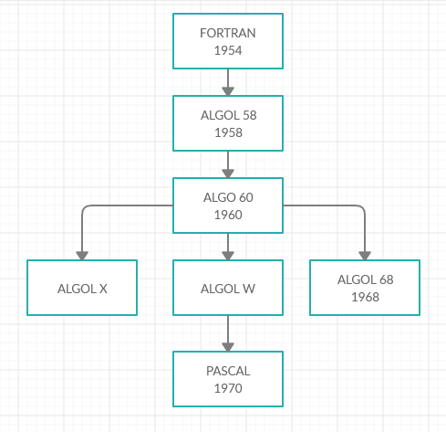

# PASCAL

## INDICE

- [Introdução](#Introdução)
- [Origens](#Origens)
- [Influências](#Influências)
- [Linha do Tempo](#Linha-do-Tempo)
- [Classificação](#Classificação)
- [Programação Estruturada](#Programação-Estruturada)
	- [Algumas linguagens que têm como principio a programação estruturada](#Algumas-linguagens-que-têm-como-principio-a-programação-estruturada)
		- [Pascal](#Pascal-1)
		- [C](#C)
		- [ALGOL 60](#ALGOL-60)
		- [ALGOL 68](#ALGOL-68)
- [Pascal e a Programação Estruturada](#Pascal-e-a-Programação-Estruturada)
	- [Sequência, Blocos, e Subrotinas em Pascal](#sequência-blocos-e-subrotinas-em-pascal)
	- [Estruturas de Seleção em Pascal](#Estruturas-de-Seleção-em-Pascal)
	- [Estruturas de Iteração em Pascal](#Estruturas-de-Iteração-em-Pascal)
- [Comparação de Pascal com outras linguagens](#Comparação-de-Pascal-com-outras-linguagens)
	- [C](#C-1)
		- [Estruturas de Seleção](#Estruturas-de-Seleção)
		- [Estruturas de Iteração](#Estruturas-de-Iteração)
		- [Subrotinas](#Subrotinas)
			- [Funções/procedimentos aninhados](#nested)
		- [Variaveis Locais](#Variáveis-Locais)
	- [ALGOL 68](#ALGOL-68-1)
		- [Estruturas de Seleção](#Estruturas-de-Seleção-1)
		- [Estruturas de Iteração](#Estruturas-de-Iteração-1)
		- [Subrotinas](#Subrotinas-1)
		- [Variaveis Locais](#Variáveis-Locais-1)
	- [ALGOL 60](#ALGOL-60-1)
		- [Estruturas de Seleção](#Estruturas-de-Seleção-2)
		- [Estruturas de Iteração](#Estruturas-de-Iteração-2)
		- [Subrotinas](#Subrotinas-2)
		- [Variaveis Locais](#Variáveis-Locais-2)
	- [Conclusão](#Conclusão)
- [Exemplos](#Exemplos)
	- [Exemplos Simples](#Exemplos-Simples)
		- [Exemplo 1](#Exemplo-1)
		- [Exemplo 2](#Exemplo-2)
		- [Exemplo 3](#Exemplo-3)
		- [Exemplo 4](#Exemplo-4)
		- [Exemplo 5](#Exemplo-5)
		- [Exemplo 6](#Exemplo-6)
		- [Exemplo 7](#Exemplo-7)
		- [Exemplo 8](#Exemplo-8)
		- [Exemplo 9](#Exemplo-9)
		- [Exemplo 10](#Exemplo-10)
		- [Exemplo 11](#Exemplo-11)
	- [Exemplos Interessantes](#Exemplos-Interessantes)
		- [Programa interessante 1](#Programa-interessante-1)
		- [Programa interessante 2](#Programa-interessante-2)
		- [Programa interessante 3](#Programa-interessante-3)
		- [Programa interessante 4](#Programa-interessante-4)
- [Referências](#Referências)

<!-- toc -->

## Introdução

**Pascal** é uma linguagem de programação **imperativa**, **procedural** e que tem como principio a **programação estruturada**. Seu nome é uma homenagem ao físico, matemático e filósofo francês Blaise Pascal. Foi criada em 1970 por **Niklaus Wirth**, para sua fábrica de software e para ensinar programação estruturada, como uma linguagem eficiênte e que encoraja boas práticas de programação. Tem  como origem a linguagem **ALGOL 60**, que tem como paradigma a **programação estruturada**, posteriormente sucedida por **ALGOL 68**, linguagem mais complexa que sua antecessora. Influênciou diversas linguagens de programação como por exemplo **Ada**, **Java**, **Modula-2** e **Oberon**. Além disso, influênciou **Object Pascal**, que é simplificadamente a linguagem **Pascal** com a adição do paradigma de programação orientado a objetos. É **linguagem compilada** de **proposito geral** que é muito usada para ensinar programação.

## Origens

**Pascal** foi criado por **Niklaus Wirth** em 1970, influenciado pelo padrão do **ALGOL 60**, sucessora do **ALGOL 58**. **ALGOL 60** foi a linguagem que introduziu o paradigma da **programação estruturada**. **Niklaus Wirth** estava envolvido no desenvolvimento de **ALGOL X** e propôs **ALGOL W**. O desenvolvimento de **ALGOL X** foi abandonado pela decisão de escolha de **ALGOL 68**, uma linguagem mais complexa. Em 1968, **Niklaus Wirth** decide desenvolver mais o **ALGOL W** e cria linguagem **Pascal** em 1970. Portanto, temos como principal origem da linguagem Pascal as linguagens **ALGOL**,
principalmente a linguagem **ALGOL W**.

## Influências

Várias foram as linguagens influênciadas por **Pascal**: **Ada**, **Java**, **Oberon**, **Oberon-2**, **Object Pascal**, **Oxygene** e etc. **Object Pascal** é a extensão da linguagem **Pascal** com orientação a objetos. Além disso, **Pascal** deu origem a diversos dialetos. Academicamente seus sucessores são **Modula-2** e **Oberon**, linguagens criadas pelo mesmo criador de **Pascal**, **Niklaus Wirth**.

## Linha do Tempo



## CLASSIFICAÇÃO

* **Linguagem de Alto Nível**
* **Linguagem Compilada**
* **Linguagem Imperativa** : paradigma de programação que usa *comandos* para mudar o *estado*(*variáveis*) do programa.
* **Linguagem Procedural** : tipo de programação **imperativa** em que o programa é constituido de uma ou mais *subrotinas*.
* **Linguagem Estática**
* **Tem como principio a programação estruturada**
* **Tem tipagem forte** : um tipo de dado não pode ser convertido a outro tipo sem conversões explícitas. Em **Pascal** 		          conversões entre tipos de dados é feito em geral de modo explícito pelo uso de *subrotinas* da               				 linguagem. 
* **Não é case sensitive** : Diferentemente de linguagens como o **C**, **Pascal** não diferencia o uppercase do lowercase dos               				  caracteres do nome de uma *variável*, *função* ou comando. Desse modo o comando "write" é o mesmo 				 que "Write" e não ocorre erro de compilação por isso, a variavel "letra" é o mesmo que "LETRA" e 			       etc.

## Programação Estruturada

**Programação Estruturada** é uma paradigma de programação com enfase em **decisão**, **iteração** e **sequência**. Surgiu no final da decada de 1950 com linguagens como **ALGOL 58** e **ALGOL 60**. Algumas linguagens que têm como principio a programação estruturada são o **ALGOL**, **Pascal**, **C** e etc. Se sustenta teoricamente pelo **teorema do programa estruturado** de 1966. Segundo o **teorema do programa estruturado**, qualquer *função computável* pode ser expressa por 3 *estruturas de controle*: **sequência**, **seleção** e **iteração**. Em **Programação Estruturada**, programas são vistos como compostos de *estruras de controles*:

* **Sequência**: *comandos* e *subrotinas* são todos executados em sequência
* **Seleção ou Decisão**: *comandos* são executados dependendo do *estado*(variáveis) do programa, a partir de um teste lógico
* **Iteração**: um *comando* ou *bloco de comandos* é executado até o programa chegar a certo *estado*(variáveis)
* **Recursão**: uma *função* que chama a si mesma. Essa estrutura já era usada em linguagens **funcionais**

Além disso, possuem estruturas como *subrotinas*, também conhecidos como *funções* ou *procedimentos*, que dividem o código em *subprogramas* e evitam a repetição dos mesmos trechos de código. Existe também a estrutura de *bloco*, que basicamente trata um conjunto de *comandos* como se fosse um único *comando*. Estruturas como **sequência**, **seleção**, **iteração**, **recursão**, **subrotinas** e **blocos** tornam a programação muito mais organizada e eficiente, além de tornar o código mais manutenível. Antes da **programação estruturada**, os códigos eram muito mais desorganizados com muitos *jumps*, tornando a programação confusa.  De modo simplificado **programação estruturada** pode ser descrita como *programação sem goto*. Esse *comando* basicamente equivale a *jumps* nas linhas do código, ou seja, o *goto* está associado uma *label* que existe em uma linha do código e quando é executado a execução passa para o comando a seguir a essa *label* a que o *goto* se refere. O uso de *goto* torna muitas vezes o código desorganizado e confuso. Foi fortemente atacado por muitos dos defensores da **programação estruturada** embora existem aqueles como **Donald Knuth** defendem seu uso em certas situações. Muitas linguagens que seguem o principio da **programação estruturada** não possuem *goto*, de modo a impedir a programação não estruturada. A maioria das linguagens que seguem o paradigma da **programação estruturada** não o seguem totalmente. Muitas delas possuem o comando *goto*, como a linguagem **C** e o **Pascal**. Além disso, grande parte das linguagens que seguem esse paradigma possuem *comandos* como *break*, *continue*, *return* que exercem funcionadades similares ao *goto*.

### Algumas linguagens que têm como principio a programação estruturada

#### Pascal

**Pascal** possui as três **estruturas de controle** que o caracterizam como uma linguagem que tem como principio a **programação estruturada**:
* **sequência**: os *comandos* em **Pascal** são executados de modo sequencial
* **seleção**: **Pascal** possui *comandos* como *if*, *then*, *else*, *case* que são partes constituintes de **estruturas de seleção*
* **iteração**: **Pascal** possui *comandos* como *for*, *repeat*, *until*, *while* que são partes constituintes de **estruturas de iteração**

#### C

**C** possui as três **estruturas de controle** que o caracterizam como uma linguagem que tem como principio a **programação estruturada**:
* **sequência**: os *comandos* em **C** são executados de modo sequencial
* **seleção**: **C** possui *comandos* como *if*, *else*, *switch* que são partes constituintes de **estruturas de seleção**
* **iteração**: C possui *comandos* como *for*, *do*, *while* que são partes constituintes de **estruturas de iteração**

#### ALGOL 60

**ALGOL 60** possui as três **estruturas de controle** que o caracterizam como uma linguagem que tem como principio a **programação estruturada**:
* **sequência**: os *comandos* em **ALGOL 60** são executados de modo sequencial
* **seleção**: **ALGOL 60** possui *comandos* como *if*, *else*, *then*, *switch* que são partes constituintes de **estruturas de seleção**
* **iteração**: **ALGOL 60**  possui *comandos* como *for*, *while*, *until*, *do* que são  partes constituintes de **estruturas de iteração**

#### ALGOL 68

**ALGOL 68** possui as três **estruturas de controle** que o caracterizam como uma linguagem que tem como principio a **programação estruturada**:
* **sequência**: os *comandos* em **ALGOL 68** são executados de modo sequencial
* **seleção**: **ALGOL 68** possui *comandos* como *if*, *else*, *then*, *case*, *fi* que são partes constituintes de **estruturas de seleção**
* **iteração**: **ALGOL 68**  possui *comandos* como *for*, *while*, *by*,*from*, *to*, *do* que são partes constituintes de **estruturas de iteração**

### Pascal e a Programação Estruturada

### Sequência, Blocos, e Subrotinas em Pascal

Todos os comandos em **Pascal** são executados de modo sequêncial, uma caracteristica fundamental da  **programação estruturada**. Além disso, um programa em **Pascal** é estruturado em *blocos*, que tratam um conjunto de comandos como se fossem um único comando. A *sintaxe* de *bloco* é *begin* e *end*, sendo o primeiro o que abre o *bloco* e o segundo o que fecha o *bloco*. **Pascal** também divide o programa em subrotinas, que são chamadas na linguagem de *funtion* ou *procedure*. A diferença entre esses dois é que enquanto uma *funtion* sempre retorna uma valor, um *procedure* não retorna nenhum valor. A *sintaxe* de *procedimento* é: *procedure..(..);begin...end;* . A seguir de *procedure* vem o nome identificador da *rotina*, entre parêntesis vem os argumentos que podem ser passados por valor, por referência ou podem ser outro *procedure*. Entre *begin* e *end;* existem os comandos que são executados na *rotina*. Já *functions* obedecem quase mesma sintaxe: *function..(..):..;begin..end;*. A seguir de dois pontos é informado o tipo de retorno da função. Variáveis locais devem ser declaradas antes do bloco iniciar, ou seja, antes de *begin*. *Variáveis locais* só podem ser acessadas dentro do bloco ao qual elas estão associadas. Nem todo o *bloco* são permite ser declaração de *variáveis*, apenas *blocos* associados a *procedure*, *function* e o *bloco* do "programa principal" podem ter declaração de variáveis anterior a eles. **Pascal** possui a possibilidade de recursão, ou seja, uma *função* ou *procedimento* chamar a si mesma.

### Estruturas de Seleção em Pascal

**Pascal** possui como **estrutura de seleção** o comando *if..then*, que possui uma expressão de tipo booleano a seguir do *if*. Se a expressão lógica for verdadeira então o comando a seguir de *then* é executado. Uma forma de executar mais que um comando é colocar os comandos dentro de um bloco ficando desse modo: *if..then begin..end*. O comando *else* é executado se a expressão lógica de *if* for falsa. Após o termino da estrutura formada de *if*, *then*, *else* é necessário acrescentar uma vírgula para informar o termino da estrutura. É possivel definir estruturas desse genêro aninhadas dentro de um comando *if*, *else*. Além disso, **Pascal** possui a **estrutura de decisão** *case..of* que analisa se a *variável* colocada entre *case* e *of* é igual ao valor de um dos seus casos,representados sintacticamente pelo valor e dois pontos, que seguem o comando. Se for igual, o comando ou *bloco* de comandos associado aquele *caso* é executado.

### Estruturas de Iteração em Pascal

**Pascal** possui as seguintes **estruturas de iteração**: 
- *for..to..do* : Atribui uma valor inicial a uma variável que já tenha sido declarada e executa repetidadmente o *bloco* de 		       comandos ou o comando até que atinja o número definido após *to*. A *variável de controle* é incrementada
		  em 1 sempre que termina o *bloco* de comandos ou comando.
- *for..downto..do* : Executa o mesmo processo que o anterior, com a diferença que ao invés de incrementar a variável de 		       controle é decrementada em 1.
- *while..do* : Verifica a expressão lógica depois do *while* e se ela for verdadeira executa o *bloco* de comandos ou comando.
		Se for falsa não executa. Repete o processo sempre que a expressão lógica for verdadeira.
- *repeat..until* : Similar ao anterior, com a excessão que primeiro executa o *bloco* de comandos ou comando e depois verifica 		    uma condição lógica a seguir do *until*. Se ela for verdadeira interrompe não repete a execução do *bloco* 			   de comandos ou comando, se for falsa repete.

## Comparação de Pascal com outras linguagens

As duas linguagens possuem muitas semalhanças já que ambas foram influênciadas pela linguagem ALGOL e suas versões, além de possuirem como paradigma a programação estruturada. No entanto possuem diferenças.

### C

#### Estruturas de Seleção

No *switch* do **C**, cada *case* do *switch* senão terminar com o *comando* *break* o próximo *case* é executado, ou seja, o *break* impede a execução de **blocos** de *comandos* de outros *case* que não eram para ser executados. Em **Pascal** a ausência de *comando* *break* em algum desses **blocos** não faz com que a execução do **bloco** de *comandos* do caso *case*(*switch* no **C**) seguinte seja executado. Em **C** o comando *if* é seguido de uma valor númerico podendo ser inteiro ou flutuante(raramente usado), algo que não acontece em **Pascal**. Isso ocorre porque em **C** não existe tipo *booleano*. Sendo assim, o verdadeiro é definido como qualquer valor diferente de 0 e o falso uma valor igual a 0.

#### Estruturas de Iteração

**Pascal** apenas permite que um *laço for* tenha dois tipos de comportamento:

* percorre um valor inicial até um valor final incrementando 1 na *variavel de controle* de *laço for*
* percorre um valor inicial até um valor final decrementando 1 na *variavel de controle* de *laço for* 

Já em **C**, temos a possibilidade de criar varios tipos de *laço for* além desses. Podemos criamos um *laço* com valor inicial para a *variavel de controle*; um teste lógico definido definido por qualquer expressão lógica; e a mudança de valor da *variavel de controle* com a atribuição de qualquer expressão aritemética à *variável de controle*. Além disso, o *laço for* pode possuir mais que uma *variavel de controle* em **C**, existindo portanto vários tipos de *laços for* na linguagem. Em **Pascal** o *laço for* tem um comportamento mais limitado que em **C**, tornando por vezes necessario a utilização de outras **estruturas de iteração**, como *while..do* e *repeat..until*, para executar a mesma tarefa que seria utilizada em **C** utilizando um *laço for*. No comando *repeat..until* do **Pascal**, a condição logica a seguir do *until* é a condição de parada do *loop*, enquanto em **C** a condição lógica presente no *while* é a condição a seguir do *while* para continuar o *loop*.

#### Subrotinas

**Pascal** possui *procedimentos* e *funções*, enquanto **C** possui apenas *funções*. Isso ocorre porque a linguagem **C** tem o tipo *void* e **Pascal** não tem. Desse modo o que seria um *procedimento* em **Pascal** é uma *função void* no **C**. **Pascal** possui duas formas de passar *argumentos* para uma *função*: *por referência*(usa-se *var*) ou *por valor*(usa-se *const*). **C** apenas possui passagem de *argumentos por valor*, mas com o uso de *ponteiros* pode-se emular uma passagem de argumentos por *referência*. Esse é um dos motivos porque a utilização de *ponteiros* é tão necessaria em **C**. Em **C** é possivel ter *ponteiros de funções*, enquanto em **Pascal** isso não é possivel. **C** permite retorno de *struct* nas *funções*, algo que não é permitido em **Pascal**.

##### Funções/procedimentos aninhados <a name="nested"></a>

Uma *função/procedimento aninhado* é uma *função/procedimento* definida dentro de uma *função*, ou seja, a *função/procedimento aninhada* é encapsulada dentro da *função* de nível superior. Fora do *escopo da função* de nível superior a *função aninhada não é detectada. Além disso, a *função aninhada* usa as *variaveis locais* da *função* de nível superior, ou seja, tem acesso ao escopo da função de nível superior. Uma das razões de sua utilização, é a utilidade de dividir *subrotinas* em outras *subrotinas* e encapsular-las. Podemos então dividir problemas mais complexos em problemas mais simples. *Funções/procedimentos aninhadas* são usadas tipicamente como *funções* auxiliares ou *funções recursivas* dentro de outra *função*. Têm como vantagem organizar melhor o código, evitando poluir o *escopo*, e compartilham *variaveis* dentro do *escopo* facilmente sem o uso de *parametros* adicionais ou usar uma *variavel global*.

O escopo de uma variável é a parte do programa onde a variável é visível. Um escopo é uma parte do programa que pode "escopar" um conjunto de nomes de entidades como variáveis ou funções. Por exemplo, se o escopo de uma variável é dentro dentro de uma função, então fora dessa função o nome dessa variável não é visível. Um escopo é a parte de programa que tem associado a ele um conjunto de nomes de variáveis. Existem dois tipos principais de escopo: escopo lexico e escopo dinâmico. Escopo lexico é o tipo de escopo onde as variáveis e nomes de funções são analisados de acordo com sua posição no código e do contexto lexico. Escopo lexico é feito modo independente da execução. Isso contrasta com o escopo dinamico que isso ocorre em tempo de execução. 


**ALGOL**, **Pascal**, **Simula 67** são algumas das linguagens que possuem *funções/procedimentos aninhados*. **C** e sua familia de linguagens não possuem *funções/procedimentos aninhados*, sendo essa uma das diferenças entre **C** e **Pascal**. Nomes de *funções* em **C** sempre são globais, a menos que sejam declaradas como *static*, e estão disponíveis para outras *funções*. 

Em **C** existem os seguintes *escopos*:  escopo global(external linkage), escopo de arquivo ou modulo(internal linkage) e o escopo local. No escopo global(external linkage) temos as variáveis acessiveis dentro de um ou mais arquivos, ou seja, a variável é visível, além do arquivo em que está escrita, em outro arquivo. No escopo de arquivo(internal linkage) a variável é visível no arquivo onde ela está escrita.  No escopo local temos variáveis locais declaradas no escopo de uma função, variáveis locais declaradas num bloco ou variáveis que são parametros de função. Variáveis locais após o termino de chamada de uma função  não têm em geral seus valores persistidos na memoria. Às vezes é necessário que o valor de uma variável local persista na memória, um exemplo para isso seria contar o número de chamadas de uma função recursiva. Para isso poderiamos usar em **C** uma variável global, no entanto isso não é uma boa prática de programação em **C**. Deve-se evitar sempre o uso de variáveis globais, usando ao invés disso variáveis de escopo local. O motivo para isso é que além de poluir o escopo global, ocorre mais erros quando uma variável é global, devido a que ela é visivel em todo código. Além disso, variáveis globais persistem constantemente na memória, ou seja, quando elas não são mais necessárias continuam ocupando espaço na memória o que pode ser um problema. Uma alternativa para esse problema em **C** são as variáveis static locais. Variáveis static locais são variáveis que só são visíveis dentro de um escopo de uma função ou bloco, mas que após a execução desse bloco ou função o seu valor é persistido na memoria. Esse tipo de variáveis é muito util para evitar o uso de variáveis globais adicionais. **C** permite aninhamento de blocos dentro de funções. Devido a que só precisa de analise do código do programa estático, é chamado também de escopo estático. Apesar de **C** possuir *escopo* lexico, assim como **Pascal** e **ALGOL**, não é possível utilizar *funções aninhadas* em **C**. Apesar de **C** não ter acesso à funcionalidade de funções aninhadas, ele consegue ter um tipo de escopos mais simples que em **Pascal** e **ALGOL** por exemplo. 

Funções aninhadas têm a presença de modo oculto de um ponteiro chamado "access link". As ativações das funções ocorre o armezanamento das mesmas numa pilha onde se inclui também os dados locais dessa função. Desse modo em linguagens que não têm o recurso de funções aninhadas só têm acesso(por ser uma pilha) aos seus parametros e suas variavéis locais. No entanto linguagens com funções aninhadas têm a presença internamente de um ponteiro chamado "acess link". Esse ponteiro basicamente aponta para o "access link" da função ao qual a função está aninhada. Desse modo, é possível à função aninhada ter acesso aos dados não locais da função de nível superior sem precisar que esses dados fossem passados por parametros, e isso independe do nível de aninhamento que tem no código, ou seja, tendo uma f1 função aninhada a outra f2 função aninhada na função f3, temos que o "access link" de f1 aponta para o "access link" de f2 e o "access link" de f2 aponta para o de f3. Desse modo, a função aninhada sempre tem acesso ao escopo da função nível. Suponha basicamente que tenha-se os procedimentos q,p,r e s; onde p e s estão aninhados ao procedimento q e r está aninhado a q. Cada um desses procedimentos possui seu ponteiro "access link". O ponteiro de p aponta para o ponteiro de q, tendo desse modo acesso ao escopo de q. Já o de r, aponta para o ponteiro de p que por sua vez aponta ao ponteiro de q. Desse modo, r tem acesso ao escopo de q e de p. Por último, o ponteiro de s tem acesso ao ponteiro de q e desse modo tem acesso ao escopo de q. 

Esse tipo de funcionalidade é útil, pois diminui a necessidade de se usar parametros adicionais com ou sem ponteiros para se ter acesso a variáveis não locais. A utilização de muitos parametros em funções torna a legibilidade e compreensão do código pior, além de que consome mais memoria da pilha onde ficam armazenadas as chamadas de funções. No entanto, aninhamento de funções mais profundos tornam a execução mais lenta, já que é necessário o ponteiro "access link" percorrer um caminho maior para conseguir acessar todas as variáveis do seu escopo. Além disso, construir compiladores para linguagens com essa funcionalidade é mais complexo. 

**C** tem como alternativas às *funções aninhadas* o uso de *variaveis static*, além de poder passar a *referência(endereço)* de *variaveis* de um certo *escopo* às *funções que deveriam ser aninhadas*, algo que aumenta a complexidade da *chamada de funções*. *Variáveis static* retêm seus valores após sucessivas chamadas de função mas só são visiveis na rotina correspondente onde são declaradas. **C** não permite *funções aninhadas* mas permite declaração de variáveis dentro de um bloco. **Pascal** pode simular um pouco essa funcionalidade com o uso de *funções/procedimentos aninhadas*. Desse modo temos que **C** para que se consiga simular as funções aninhadas ele necessita usar mais parametros.

Suponha por exemplo que se queira criar uma função que além do seu trecho de código chama outras funções para operações somente dentro dessa função. Essas funções no caso receberiam parametros. Se o objetivo dessas subfunções é retornar apenas um número a partir de uma certa quantidade de variaveis temos que em **C** existe a desvantagem de que se necessita passar parametros para a essa subfunção que em **Pascal**, usando o recurso de *função aninhada*, não é necessário, já que os parametros poderiam ser acessados por essa *subfunção* se ela estivesse aninhada à função principal. Por outro lado, imagine o caso em que é necessário não só um retorno com essa *subfunção* mas também é necessario a modificação dos seus parametros. Em **Pascal** usando *funções aninhadas* é relativamente simples, e em muitos casos não precisa declarar nenhum parametro nessa *subfunção*. Porém, como **C** não possui essa funcionalidade, é necessário não só declarar mais argumentos, como também em alguns casos declarar-los em formato de ponteiro, o que dificulta a compreensão do código. Além disso, cada *subfunção* em **C** deve estar declarada no escopo global, tornando o código menos compreensivel. Dessa situação temos como opção em **C** declarar as *subfunções* assumindo o código nelas presente como o código extra da função principal, nesse caso, o programa fica menos modularizado e de mais dificil compreensão. Uma outra opção seria assumir as variáveis como globais, algo que não é aconselhavel. Por outro lado, suponha uma função recursiva que é chamada várias vezes e precisa armazenar um valor numa variável de modo permanente. Uma opção em **C** seria declarar a variável como *static*, no caso do **Pascal** podemos definir-mos a função recursiva aninhada a uma função principal com essa variável na função principal. Desse modo, é comum ver códigos em **Pascal**, que uma função recursiva é implementada como uma função aninhada recursiva dentro de uma função principal não recursiva. Uma das vantagens disso é que se reduz o número de parametros necessários e a dificuldade de passar-los. Suponha por exemplo que a função recursiva opere sobre um vetor mas sua recursão tem haver apenas com um certo número inteiro. Se declarar-mos essa função de modo aninhado a uma função principal não recursiva podemos colocar como argumentos da principal o vetor e outros argumentos necessários mas que não são a base do processo de recursão. Um outro detalhe, é que na recursão, a chamada de funções é armazenada numa pilha, que armazena os argumentos dessa função também. Evitar de criar funções muito longas em argumentos tem como vantagem não sobrecarregar essa pilha, que no caso de recursão pode ser sobrecarregada, e também torna mais compreensível o código.


Tome como exemplo o código em **Pascal**:

procedure F();
var
	x:integer;
	procedure G();
	var
		y,z:integer;
		procedure H();
		var
			z:integer;
		begin
			x:=x+2;
			y:=y+2;
			z:=2;
			writeln(x,' ',y,' ',z);
		end;
	begin
		x:=2;
		y:=2;
		z:=5;
		writeln(x,' ',y,' ',z);
		H();
	end;
	procedure I();
	var
		a,z:integer;
	begin
		x:=x+1;
		a:=1;
		z:=1;
		writeln(x,' ',a,' ',z);
	end;
begin
	x:=1;
	writeln(x);
	G();
	writeln(x);
	I();
	writeln(x);
end;

O procedimento F tem apenas acesso à variável x e variáveis que são globais. O procedimento G tem acesso às variáveis y,z e a x, que é a variável do procedimento F que é de nível superior. O procedimento H tem acesso às variáveis x,y e z, só que a variável z definida em H não é a mesma que a variável z definida em G. Isso ocorre porque possuem o mesmo nome e se o nome de uma variável definida localmente na função é o mesmo de uma variável definida numa função de nível acima ou é global, então o nome corresponde à variável definida localmente na função. Já no caso de I, temos acesso a x,a,z sendo que z não corresponde nem a variável G e nem a variável H.
Um mesmo código que tem a mesma funcionalidade só que em C seria:

void I(int * x){
	int a,z;
	(*x)++;
	a=1;
	z=1;
	printf("%d %d %d\n",*x,a,z);
}
void H(int * x,int * y){
	int z;
	(*x)+=2;
	(*y)+=2;
	z=2;
	printf("%d %d %d\n",*x,*y,z);
}
void G(int * x);
	int y,z;
	(*x)=2;
	y=2;
	z=5;
	printf("%d %d %d\n",*x,y,z);
	H(x,&y);
}
void F();
	int x;
	x=1;
	printf("%d\n",x);
	G(&x);
	printf("%d\n",x);
	I(&x);
	printf("%d\n",x);
}

O código em **C** possui funções com maior número de parametros, dificultando sua legibilidade e entendimento, além de alguns parametros são ponteiros, dificultando a elaboração das funções e tornando o código menos seguro. Por outro lado, **Pascal** consegue organizar melhor o seu código, dividindo e encapsulando rotinas que são partes de uma rotina principal. Uma outras alternativa de código em **C** seria escrever todas essas funções como se fosse uma única rotina. No caso deste exemplo, é algo plausível, mas dependendo do tamanho das funções, este fica menos modularizado e portanto menos compreensivel. Por outro lado, pode ocorrer de haver repetição de trechos de código nessa única função, sendo portanto aconselhavel o uso de uma função. Uma outra alternativa a isso, seria usar variáveis globais. Essa prática não é aconselhavel, deve-se evitar ao máximo uso de variáveis globais.

**Alguns Exemplos do uso de funções aninhadas**

**MergeSort**

Código que implementa o Mergesort em **Pascal** usando funções aninhadas comparado com o código **C** que não possui esse recurso.  É interessante notar como o código **C** possui funções que dependem de muito mais argumentos, inclusive alguns dos argumentos sendo ponteiros, o que dificulta a programação. Além disso, o código em **Pascal** possui mais organização do que o código em **C**. Para evitar esses problemas do **C** poderiamos criar um modulo novo, ou seja, escrever essas funções num novo arquivo e com isso compartilhar certas variáveis globais importantes de modo a ter um menor número de argumentos e evitar o uso de ponteiros.

**Pascal**

``` pascal
program msort;

var
	ch:char;

procedure sort(var v:array of integer;n:integer);
	procedure MergeSort(const i,f:integer);
	var
		m:integer;
		procedure Merge();
		var
			t:array[1..10000] of integer;
			r,s,k:integer;

			procedure cpArray();
			var
				j:integer;
			begin
				for j:=i to f do
					v[j]:=t[j];
			end;
		begin
			r:=i;
			s:=m+1;
			for k:=i to f do
			begin
				if (s>f) or ((r<=m) and (v[r]<v[s])) then
				begin
					t[k]:=v[r];
					r:=r+1;
				end
				else
				begin
					t[k]:=v[s];
					s:=s+1;
				end;
			end;
			cpArray();
		end;
	begin
		if ((f-i)>0) then
		begin
			m:=((f+i) div 2);
			MergeSort(i,m);
			MergeSort(m+1,f);
			Merge();
		end;
	end;
begin
	MergeSort(0,n-1);
end;

procedure prog();
var 
	n:integer;
	v:array[1..10000] of integer;
	
	procedure leVetor();
	var
		x:integer;
	begin
		n:=0;
		while true do
		begin
			write('v[',n+1,'] = ');
			readln(x);
			if x<0 then
			begin
				break;
			end;
			n:=n+1;
			v[n]:=x;
		end;
	end;

	procedure imprVetor();
	var
		i:integer;
	begin
		writeln();
		for i:=1 to n do
		begin
			write(v[i],' ');
		end;
		writeln();
	end;
begin
	leVetor();
	imprVetor();
	sort(v,n);
	imprVetor();
end;

begin
	repeat
	begin
		prog();
		write(#10,'Deseja continuar(caracter s)? ');
		readln(ch);
	end;
	until ch<>'s';
end.
```


**C**

``` C
#include<stdio.h>

char ch;

void cpArray(int * v,int * t,int i,int f){
	int j;
	for(j=i;j<=f;j++){
		v[j]=t[j];
	}
}

void Merge(int * v,int i,int f,int m){
	int t[10001];
	int r,s,k;
	r=i;
	s=m+1;
	for(k=i;k<=f;k++){
		if((s>f) || ((r<=m) && (v[r]<v[s]))){
			t[k]=v[r];
			r++;
		}
		else{
			t[k]=v[s];
			s++;
		}
	}
	cpArray(v,t,i,f);
}

void MergeSort(int * v,int i,int f){
	int m;
	if((f-i)>0){
		m=(int)((f+i)/2);
		MergeSort(v,i,m);
		MergeSort(v,m+1,f);
		Merge(v,i,f,m);
	}			
}

void leVetor(int * v,int * n){
	int x;
	*n=0;
	for(;;){
		printf("v[%d] = ",(*n)+1);
		scanf("%d",&x);
		if(x<0){
			break;
		}
		(*n)++;
		v[(*n)]=x;
	}
}

void imprVetor(int * v,int n){
	int i;
	printf("\n");
	for(i=1;i<=n;i++){
		printf("%d ",v[i]);
	}
	printf("\n");
}
	
void prog(){
	int n;
	int v[10001];	
	leVetor(v,&n);
	imprVetor(v,n);
	MergeSort(v,0,n-1);
	imprVetor(v,n);
}

int main(){
	do{
		prog();
		printf("\nDeseja continuar(caracter s)? ");
		fflush(stdin);
		scanf("%c",&ch);
	}while(ch=='s');
	return 0;
}
```

**QuickSort**

Código que implementa o Quicksort em **Pascal** usando funções aninhadas comparado com o código **C** que não possui. As conclusões são as mesmas obtidas no Mergesort: no código em **C**, as funções dependem de um maior número de argumentos, é mais desorganizado e tem que fazer uso de ponteiros em casos que não seria necessário em **Pascal**.

**Pascal**

``` pascal
program qsort;

var
	ch:char;

procedure sort(var v:array of integer;n:integer);
	procedure quicksort(e,d:integer);
	var
		i,j:integer;
		procedure particao();
		var
			t:integer;
			procedure swap(var x,y:integer);
			var
				tmp:integer;
			begin
				tmp:=x;
				x:=y;
				y:=tmp;
			end;
		begin
			i:=e;
			j:=d;
			t:=v[(e+d) div 2];
			while i<=j do
			begin
				while v[i]<t do
					i:=i+1;
				while v[j]>t do
					j:=j-1;
				if i<=j then
				begin
					swap(v[i],v[j]);
					i:=i+1;
					j:=j-1;
				end;
			end;
		end;
	begin
		if d>e then
		begin
			particao();
			quicksort(e,j);
			quicksort(i,d);
		end;
	end;
begin
	quicksort(0,n-1);
end;

procedure prog();
var 
	n:integer;
	v:array[1..10000] of integer;
	procedure leVetor();
	var
		x:integer;
	begin
		n:=0;
		while true do
		begin
			write('v[',n+1,'] = ');
			readln(x);
			if x<0 then
			begin
				break;
			end;
			n:=n+1;
			v[n]:=x;
		end;
	end;

	procedure imprVetor();
	var
		i:integer;
	begin
		writeln();
		for i:=1 to n do
		begin
			write(v[i],' ');
		end;
		writeln();
	end;
begin
	leVetor();
	imprVetor();
	sort(v,n);
	imprVetor();
end;

begin
	repeat
	begin
		prog();
		write(#10,'Deseja continuar(caracter s)? ');
		readln(ch);
	end;
	until ch<>'s';
end.
```

**C**

``` C
#include<stdio.h>

char ch;

void swap(int * x,int * y){
		int tmp=*x;
		*x=*y;
		*y=tmp;
}


void particao(int * v,int * i,int * j,int e,int d){
	int t;
	*i=e;
	*j=d;
	t=v[(int)((e+d)/2)];
	while((*i)<=(*j)){
		while(v[(*i)]<t){
			(*i)++;
		}
		while(v[(*j)]>t){
			(*j)--;
		}
		if((*i)<=(*j)){
			swap(&v[(*i)],&v[(*j)]);
			(*i)++;
			(*j)--;
		}
	}
}

void quicksort(int * v,int e,int d){
	int i;
	int j;
	if(d>e){
		particao(v,&i,&j,e,d);
		quicksort(v,e,j);
		quicksort(v,i,d);
	}

}

void leVetor(int * v,int * n){
	int x;
	*n=0;
	for(;;){
		printf("v[%d] = ",(*n)+1);
		scanf("%d",&x);
		if(x<0){
			break;
		}
		(*n)++;
		v[(*n)]=x;
	}
}

void imprVetor(int * v,int n){
	int i;
	printf("\n");
	for(i=1;i<=n;i++){
		printf("%d ",v[i]);
	}
	printf("\n");
}
	
void prog(){
	int n;
	int v[10001];
	leVetor(v,&n);
	imprVetor(v,n);
	quicksort(v,0,n);
	imprVetor(v,n);
}

int main(){
	do{
		prog();
		printf("\nDeseja continuar(caracter s)? ");
		fflush(stdin);
		scanf("%c",&ch);
	}while(ch=='s');
	return 0;

}
```

**BubbleSort**

Programa que implementa o bubblesort usando de funções aninhadas e recursão.

**Pascal**

``` pascal
program bsort;

var
	ch:char;

procedure sort(var v:array of integer;n:integer);
	procedure buble(n:integer);
		procedure troca(i:integer);
			procedure swap(var x,y:integer);
			var 
				tmp:integer;
			begin
				tmp:=x;
				x:=y;
				y:=tmp;
			end;
		begin
			if i>=0 then
			begin
				troca(i-1);
				if v[i]>v[i+1] then
					swap(v[i],v[i+1]);
			end;
		end;
	begin
		if n>=0 then
		begin
			troca(n-1);
			buble(n-1);
		end;
	end;
begin
	buble(n-1);
end;

procedure prog();
var 
	n:integer;
	v:array[1..10000] of integer;
	procedure leVetor();
	var
		x:integer;
	begin
		n:=0;
		while true do
		begin
			write('v[',n+1,'] = ');
			readln(x);
			if x<0 then
			begin
				break;
			end;
			n:=n+1;
			v[n]:=x;
		end;
	end;

	procedure imprVetor();
	var
		i:integer;
	begin
		writeln();
		for i:=1 to n do
		begin
			write(v[i],' ');
		end;
		writeln();
	end;
begin
	leVetor();
	imprVetor();
	sort(v,n);
	imprVetor();
end;

begin
	repeat
	begin
		prog();
		write(#10,'Deseja continuar(caracter s)? ');
		readln(ch);
	end;
	until ch<>'s';
end.
```

**C**

``` C
#include<stdio.h>

char ch;

void swap(int * x,int * y){
		int tmp=*x;
		*x=*y;
		*y=tmp;
}

void troca(int * v,int i){
	if(i>=0){
		troca(v,i-1);
		if(v[i]>v[i+1]){
			swap(&v[i],&v[i+1]);
		}
	}
}

void buble(int * v,int n){
	if(n>=0){
		troca(v,n-1);
		buble(v,n-1);
	}
}

void leVetor(int * v,int * n){
	int x;
	*n=0;
	for(;;){
		printf("v[%d] = ",(*n)+1);
		scanf("%d",&x);
		if(x<0){
			break;
		}
		(*n)++;
		v[(*n)]=x;
	}
}

void imprVetor(int * v,int n){
	int i;
	printf("\n");
	for(i=1;i<=n;i++){
		printf("%d ",v[i]);
	}
	printf("\n");
}
	
void prog(){
	int n;
	int v[10001];
	leVetor(v,&n);
	imprVetor(v,n);
	buble(v,n);
	imprVetor(v,n);
}

int main(){
	do{
		prog();
		printf("\nDeseja continuar(caracter s)? ");
		fflush(stdin);
		scanf("%c",&ch);
	}while(ch=='s');
	return 0;
}
```

**Selection Sort**
**Pascal**
``` pascal
program ssort;

var
	ch:char;
	
procedure sort(var v:array of integer;n:integer);
	procedure swap(var x,y:integer);
	var
		tmp:integer;
	begin
		tmp:=x;
		x:=y;
		y:=tmp;
	end;
	procedure selection(n:integer);
	var
		pmax,i:integer;
	begin
		if n>0 then
		begin
			pmax:=0;
			for i:=1 to n do
			begin
				if v[i]>v[pmax] then
				begin
					pmax:=i;
				end;
			end;
			swap(v[pmax],v[n]);
			selection(n-1);
		end;
	end;
begin
	selection(n-1);
end;

procedure prog();
var 
	n:integer;
	v:array[1..10000] of integer;

	procedure leVetor();
	var
		x:integer;
	begin
		n:=0;
		while true do
		begin
			write('v[',n+1,'] = ');
			readln(x);
			if x<0 then
			begin
				break;
			end;
			n:=n+1;
			v[n]:=x;
		end;
	end;
	procedure imprVetor();
	var
		i:integer;
	begin
		writeln();
		for i:=1 to n do
		begin
			write(v[i],' ');
		end;
		writeln();
	end;
begin
	leVetor();
	imprVetor();
	sort(v,n);
	imprVetor();
end;

begin
	repeat
	begin
		prog();
		write(#10,'Deseja continuar(caracter s)? ');
		readln(ch);
	end;
	until ch<>'s';
end.
```

**C**
``` C
#include<stdio.h>

char ch;

void swap(int * x,int * y){
	int tmp;
	tmp=(*x);
	(*x)=(*y);
	(*y)=tmp;
}

void selection(int * v,int n){
	int pmax,i;
	if(n>0){
		pmax=0;
		for(i=1;i<=n;i++){
			if(v[i]>v[pmax]){
				pmax=i;
			}
		}
		swap(&v[pmax],&v[n]);
		selection(v,n-1);
	}
}

void leVetor(int * v, int * n){
	int x;
	(*n)=0;
	for(;;){
		printf("v[%d] = ",(*n)+1);
		scanf("%d",&x);
		if(x<0){
			break;
		}
		(*n)++;
		v[(*n)]=x;
	}
}

void imprVetor(int * v, int n){
	int i;
	printf("\n");
	for(i=1;i<=n;i++){
		printf("%d ",v[i]);
	}
	printf("\n");
}

void prog(){
	int n;
	int v[10001];
	leVetor(v,&n);
	imprVetor(v,n);
	selection(v,n);
	imprVetor(v,n);
}

int main(){
	do{
		prog();
		printf("\nDeseja continuar(caracter s)? ");
		fflush(stdin);
		scanf("%c",&ch);
		fflush(stdin);
	}while(ch=='s');
	return 0;
}
```

**Subconjuntos**
**Pascal**
``` pascal
program subconjuntos;

var
	ch:char;
	
procedure sort(var v:array of integer;n:integer);
	procedure quicksort(e,d:integer);
	var
		i,j:integer;
		procedure particao();
		var
			t:integer;
			procedure swap(var x,y:integer);
			var
				tmp:integer;
			begin
				tmp:=x;
				x:=y;
				y:=tmp;
			end;
		begin
			i:=e;
			j:=d;
			t:=v[(e+d) div 2];
			while i<=j do
			begin
				while v[i]<t do
					i:=i+1;
				while v[j]>t do
					j:=j-1;
				if i<=j then
				begin
					swap(v[i],v[j]);
					i:=i+1;
					j:=j-1;
				end;
			end;
		end;
	begin
		if d>e then
		begin
			particao();
			quicksort(e,j);
			quicksort(i,d);
		end;
	end;
begin
	quicksort(0,n-1);
end;

procedure subconjunto(c:array of integer;n:integer);
var
	sb:array[1..100] of integer;
	np:integer=0;
	q:integer=0;
	cont:integer=1;

	procedure comb(t:integer);
	var
		i:integer;
		procedure impr();
		var 
			i:integer;
		begin
			write('{  ');
			for i:=1 to q do
			begin
				if i<>1 then
					write(' ; ');
				write(sb[i]);
			end;
			writeln('  }');
		end;
	begin
		for i:=t to n do
		begin
			np:=np+1; 
			sb[np]:=c[i-1];
			if np=q then
			begin
				cont:=cont+1;				
				impr();
			end
			else
			begin
				comb(i+1);
			end;
			np:=np-1;
		end;
	end;
begin
	writeln(#10,'{ vazio }');
	for q:=0 to n do
		comb(1);
	writeln(#10,'numero de subconjuntos = ',cont);
end;

procedure prog();
var 
	n,i:integer;
	c:array[1..100] of integer;
	b:boolean;

	procedure leConjunto();
	var
		x:integer;
	begin
		n:=0;
		while true do
		begin
			write('c[',n+1,'] = ');
			readln(x);
			if x<0 then
			begin
				break;
			end;
			n:=n+1;
			c[n]:=x;
		end;
	end;
	procedure imprConjunto();
	var
		i:integer;
	begin
		writeln();
		for i:=1 to n do
		begin
			write(c[i],' ');
		end;
		writeln();
	end;
begin
	leConjunto();
	sort(c,n);
	b:=true;
	for i:=1 to n-1 do
	begin
		if c[i]=c[i+1] then
		begin
			writeln('Erro. Elementos repetidos...');
			b:=false;
		end;
	end;
	if b then
	begin
		imprConjunto();
		subconjunto(c,n);
	end;
end;

begin
	repeat
	begin
		prog();
		write(#10,'Deseja continuar(caracter s)? ');
		readln(ch);
	end;
	until ch<>'s';
end.
```

**C**
``` C
#include<stdio.h>
char ch;

void swap(int * x,int * y){
		int tmp=*x;
		*x=*y;
		*y=tmp;
}

void particao(int * v,int * i,int * j,int e,int d){
	int t;
	*i=e;
	*j=d;
	t=v[(int)((e+d)/2)];
	while((*i)<=(*j)){
		while(v[(*i)]<t){
			(*i)++;
		}
		while(v[(*j)]>t){
			(*j)--;
		}
		if((*i)<=(*j)){
			swap(&v[(*i)],&v[(*j)]);
			(*i)++;
			(*j)--;
		}
	}
}

void quicksort(int * v,int e,int d){
	int i;
	int j;
	if(d>e){
		particao(v,&i,&j,e,d);
		quicksort(v,e,j);
		quicksort(v,i,d);
	}
}
void impr(int * sb,int q){
	int i; 
	printf("{  ");
	for(i=1;i<=q;i++){
		if(i!=1){
			printf(" ; ");
		}
		printf("%d",sb[i]);
	}
	printf("  }\n");
}

void comb(int t,int * sb,int * np,int q,int * cont,int n,int * c){
	int i;
	for(i=t;i<=n;i++){
		(*np)++; 
		sb[*np]=c[i];
		if((*np)==(q)){
			(*cont)++;				
			impr(sb,q);
		}
		else{
			comb(i+1,sb,np,q,cont,n,c);
		}
		(*np)--;
	}
}

void subconjunto(int * c,int n){
	int sb[101];
	int np=0;
	int q=2;
	int cont=1;
	printf("\n{ vazio }\n");
	for(q=1;q<=n;q++)
		comb(1,sb,&np,q,&cont,n,c);
	printf("\n numero de subconjuntos = %d\n",cont);
}

void leConjunto(int * c,int * n){
	int x;
	*n=0;
	for(;;){
		printf("c[%d] = ",(*n)+1);
		scanf("%d",&x);
		if(x<0){
			break;
		}
		(*n)++;
		c[*n]=x;
		fflush(stdin);
	}
}
```

**Permutação**
**Pascal**
``` pascal
program permutacao;
var
	ch:char;
	numero:integer;
	
procedure permut(var v:array of integer;n:integer);
var
	np:integer=0;
	s:array[1..5] of integer;
	p:array[1..5] of integer;
	
	procedure initBol();
	var
		i:integer;
	begin
		for i:=1 to n do
			s[i]:=0;		
	end;
	
	procedure perm();
	var
		i:integer;
		procedure impr();
		var
			j:integer;
		begin
			for j:=1 to n do
				write(p[j],' ');
			writeln();
		end;
	begin
		for i:=1 to n do
		begin
			if s[i]=0 then
			begin
				np:=np+1;
				p[np]:=v[i-1];
				s[i]:=1;

				if np=n then
				begin
					impr();
					numero:=numero+1;
				end
				else
				begin
					perm();
				end;
				np:=np-1;
				s[i]:=0;
			end;
		end;
	end;
begin
	numero:=numero+1;
	initBol();
	perm();
end;

procedure prog();
var
	n:integer;
	v:array[1..5] of integer;

	procedure leVetor();
	var
		x,i:integer;
	begin
		n:=0;
		for i:=1 to 5 do
		begin
			write('v[',n+1,'] = ');
			readln(x);
			if x<0 then
			begin
				break;
			end;
			n:=n+1;
			v[n]:=x;
		end;
	end;
begin
	numero:=0;
	leVetor();
	permut(v,n);
	writeln(#10,'numero de permutacoes = ',numero-1);
end;

begin
	repeat
	begin
		prog();
		write(#10,'Deseja continuar(caracter s)? ');
		readln(ch);
	end;
	until ch<>'s';
end.
```

**C**
``` C
#include<stdio.h>
char ch;
int numero;

void initBol(int n,int * s){
	int i;
	for(i=1;i<=n;i++){
		s[i]=0;
	}			
}
void impr(int n,int * p){
	int j;
	for(j=1;j<=(n);j++){
		printf("%d ",p[j]);
	}
	printf("\n");
}

void perm(int n,int * s,int * np,int * p,int * v){
	int i;
	for(i=1;i<=n;i++){
		if(s[i]==0){ 
			(*np)++;
			p[(*np)]=v[i];
			s[i]=1;
			
			if((*np)==n){
				impr(n,p);
				numero++;
			}
			else{
				perm(n,s,np,p,v);
			}
			(*np)--;
			s[i]=0;
		}
	}
}

void permut(int * v,int n){
	int np=0;
	int s[6];
	int p[6];
	numero++;
	initBol(n,s);
	perm(n,s,&np,p,v);
}

void leVetor(int * n,int * v){
	int x,i;
	(*n)=0;
	for(i=1;i<=5;i++){
		printf("v[%d] = ",(*n)+1);
		scanf("%d",&x);
		fflush(stdin);
		if(x<0){
			break;
		}
		(*n)++;
		v[(*n)]=x;
	}
}

void prog(){
	int n;
	int v[6];
	numero=0;
	leVetor(&n,v);
	permut(v,n);
	printf("\nnumero de permutacoes = %d\n",numero-1);
}

int main(){
	do{
		prog();
		printf("\nDeseja continuar(caracter s)? ");
		scanf("%c",&ch);
		fflush(stdin);
	}while(ch=='s');
	return 0;
}
```

**Busca Binaria**
**Pascal**
``` pascal
program busca;

var
	ch:char;

procedure sort(var v:array of integer;n:integer);
	procedure quicksort(e,d:integer);
	var
		i,j:integer;
		procedure particao();
		var
			t:integer;
			procedure swap(var x,y:integer);
			var
				tmp:integer;
			begin
				tmp:=x;
				x:=y;
				y:=tmp;
			end;
		begin
			i:=e;
			j:=d;
			t:=v[(e+d) div 2];
			while i<=j do
			begin
				while v[i]<t do
					i:=i+1;
				while v[j]>t do
					j:=j-1;
				if i<=j then
				begin
					swap(v[i],v[j]);
					i:=i+1;
					j:=j-1;
				end;
			end;
		end;
	begin
		if d>e then
		begin
			particao();
			quicksort(e,j);
			quicksort(i,d);
		end;
	end;
begin
	quicksort(0,n-1);
end;

procedure busca(v:array of integer;n,x:integer);
var
	k:integer=-1;
	function bin(i,f:integer):integer;
	var
		m:integer;
	begin
		if i>f then
		begin
			bin:=-1;
		end
		else
		begin
			m:=(i+f) div 2;
			if v[m]=x then
			begin
				bin:=m;
			end
			else if v[m]>x then
			begin
				bin:=bin(i,m-1);
			end
			else if v[m]<x then
			begin
				bin:=bin(m+1,f);
			end;
		end;
	end;
begin
	k:=bin(1,n);
	if k=(-1) then
	begin
		writeln('Elemento nao encontrado');
	end
	else
	begin
		writeln('Elemento esta na posicao ',k+1);
	end;
end;

procedure prog();
var 
	n,x:integer;
	v:array[1..10000] of integer;

	procedure leVetor();
	var
		x:integer;
	begin
		n:=0;
		while true do
		begin
			write('v[',n+1,'] = ');
			readln(x);
			if x<0 then
			begin
				break;
			end;
			n:=n+1;
			v[n]:=x;
		end;
	end;
	procedure imprVetor();
	var
		i:integer;
	begin
		writeln();
		for i:=1 to n do
		begin
			write(v[i],' ');
		end;
		writeln();
	end;
	procedure leElemento();
	begin
		write('elemento a buscar = ');
		readln(x);
	end;
begin
	leVetor();
	imprVetor();
	sort(v,n);
	imprVetor();
	leElemento();
	busca(v,n,x);
end;

begin
	repeat
	begin
		prog();
		write(#10,'Deseja continuar(caracter s)? ');
		readln(ch);
	end;
	until ch<>'s';
end.
```
**C**
``` C
#include<stdio.h>
char ch;

void swap(int * x,int * y){
		int tmp=*x;
		*x=*y;
		*y=tmp;
}

void particao(int * v,int * i,int * j,int e,int d){
	int t;
	*i=e;
	*j=d;
	t=v[(int)((e+d)/2)];
	while((*i)<=(*j)){
		while(v[(*i)]<t){
			(*i)++;
		}
		while(v[(*j)]>t){
			(*j)--;
		}
		if((*i)<=(*j)){
			swap(&v[(*i)],&v[(*j)]);
			(*i)++;
			(*j)--;
		}
	}
}

void quicksort(int * v,int e,int d){
	int i;
	int j;
	if(d>e){
		particao(v,&i,&j,e,d);
		quicksort(v,e,j);
		quicksort(v,i,d);
	}
}

void leVetor(int * v,int * n){
	int x;
	*n=0;
	for(;;){
		printf("v[%d] = ",(*n)+1);
		scanf("%d",&x);
		if(x<0){
			break;
		}
		(*n)++;
		v[(*n)]=x;
	}
}

void imprVetor(int * v,int n){
	int i;
	printf("\n");
	for(i=1;i<=n;i++){
		printf("%d ",v[i]);
	}
	printf("\n");
}

void leElemento(int * x){
	printf("elemento a buscar = ");
	fflush(stdin);
	scanf("%d",x);
	fflush(stdin);
}

int bin(int * v,int x,int i,int f){
	int m;
	if(i>f){
		return (-1);
	}
	else{
		m=(int)((i+f)/2);
		if(v[m]==x){
			return m;
		}
		else if(v[m]>x){
			return bin(v,x,i,m-1);
		}
		else if(v[m]<x){
			return bin(v,x,m+1,f);
		}
	}
}

void busca(int * v, int n, int x){
	int k=-1;
	k=bin(v,x,1,n);
	if(k==(-1)){
		printf("Elemento nao encontrado\n");
	}
	else{
		printf("Elemento esta na posicao %d\n",k);
	}
}

void prog(){
	int n,x;
	int v[10001];

	leVetor(v,&n);
	imprVetor(v,n);
	quicksort(v,0,n);
	imprVetor(v,n);
	leElemento(&x);
	busca(v,n,x);
}

int main(){
	do{
		prog();
		printf("\nDeseja continuar(caracter s)? ");
		fflush(stdin);
		scanf("%c",&ch);
	}while(ch=='s');
	return 0;
}
```

**Quadrado Magico**
**Pascal**
``` pascal
program qmagico;

var
	ch:char;
	
procedure sort(var v:array of integer;n:integer);
	procedure buble(n:integer);
		procedure troca(i:integer);
			procedure swap(var x,y:integer);
			var 
				tmp:integer;
			begin
				tmp:=x;
				x:=y;
				y:=tmp;
			end;
		begin
			if i>=0 then
			begin
				troca(i-1);
				if v[i]>v[i+1] then
					swap(v[i],v[i+1]);
			end;
		end;
	begin
		if n>=0 then
		begin
			troca(n-1);
			buble(n-1);
		end;
	end;
begin
	buble(n-1);
end;

procedure quadrado(v:array of integer);
var
	np:integer=0;
	s:array[1..9] of integer;
	p:array[1..9] of integer;
	num:integer=0;
	qtd:integer=0;
	
	procedure initBol();
	var
		i:integer;
	begin
		for i:=1 to 9 do
			s[i]:=0;		
	end;
	procedure magico();
	var
		i:integer;
		procedure impr();
		var
			j:integer;
		begin
			writeln();
			for j:=1 to 9 do
			begin
				write(p[j],' ');
				if (j mod 3)=0 then
					writeln();
			end;
			writeln();
		end;

		function teste():boolean;
		var
			j,k:integer;
		begin
			teste:=true;
			k:=p[1]+p[5]+p[9];
			for j:=1 to 3 do
			begin
				if k<>(p[(j-1)*3+1]+p[((j-1)*3)+2]+p[((j-1)*3)+3]) then
				begin
					teste:=false;
					break;
				end;
			end;
			for j:=1 to 3 do
			begin
				if k<>(p[j]+p[j+3]+p[j+6]) then
				begin
					teste:=false;
					break;
				end;
			end;
			if k<>(p[3]+p[5]+p[7]) then
				teste:=false;
		end;
	begin
		for i:=1 to 9 do
		begin
			if s[i]=0 then
			begin
				np:=np+1;
				p[np]:=v[i-1];
				s[i]:=1;
				qtd:=qtd+1;
				if ((np=9) and (teste()) ) then
				begin
						if num=0 then
							impr();
						num:=1;
				end
				else
				begin
					magico();
				end;
				
				np:=np-1;
				s[i]:=0;
			end;
		end;
	end;
begin
	initBol();
	magico();
	if num=0 then
	begin
		writeln('nao tem quadrado magico');
	end;
end;

procedure prog();
var
	v:array[1..9] of integer;
	
	procedure leVetor();
	var
		i:integer;
	begin
		for i:=1 to 9 do
		begin
			write('v[',i,'] = ');
			readln(v[i]);
		end;
	end;
begin
	leVetor();
	sort(v,9);
	quadrado(v);
end;

begin
	repeat
	begin
		prog();
		write(#10,'Deseja continuar(caracter s)? ');
		readln(ch);
	end;
	until ch<>'s';
end.
```

**C**
``` C
#include<stdio.h>
char ch;

void swap(int * x,int * y){
		int tmp=*x;
		*x=*y;
		*y=tmp;
}

void troca(int * v,int i){
	if(i>0){
		troca(v,i-1);
		if(v[i]>v[i+1]){
			swap(&v[i],&v[i+1]);
		}
	}
}

void buble(int * v,int n){
	if(n>0){
		troca(v,n-1);
		buble(v,n-1);
	}
}

void initBol(int * s){
	int i;
	for(i=1;i<=9;i++){
			s[i]=0;		
	}
}

void impr(int * p){
	int j;
	printf("\n");
	for(j=1;j<=9;j++){
		printf("%d ",p[j]);
		if((j%3)==0){
			printf("\n");
		}
	}
	printf("\n");
}

int teste(int * p){
	int j,k;
	k=p[1]+p[5]+p[9];
	for(j=1;j<=3;j++){
		if(k!=(p[((j-1)*3)+1]+p[((j-1)*3)+2]+p[((j-1)*3)+3])){
			return 0;
		}
	}
	for(j=1;j<=3;j++){

		if(k!=(p[j]+p[j+3]+p[j+6])){

			return 0;

		}

	}
	if(k!=(p[3]+p[5]+p[7])){
		return 0;
	}
	return 1;
}

void magico(int * s,int * p,int * v,int * np,int * num,int * qtd){
	int i;
	for(i=1;i<=9;i++){
		if(s[i]==0){
			(*np)++;
			p[(*np)]=v[i];
			s[i]=1;
			(*qtd)++;
			if(((*np)==9)&&(teste(p)==1)){
				if((*num)==0){
					impr(p);
				}
				(*num)=1;
			}
			else{
				magico(s,p,v,np,num,qtd);
			}
			(*np)--;
			s[i]=0;
		}
	}
}

void quadrado(int * v){
	int np=0;
	int s[10];
	int p[10];
	int num=0;
	int qtd=0;
	initBol(s);
	magico(s,p,v,&np,&num,&qtd);
	if(num==0){
		printf("nao tem quadrado magico\n");
	}
}

void leVetor(int * v){
	int i;
	for(i=1;i<=9;i++){
		printf("v[%d] = ",i);
		scanf("%d",&v[i]);
	}
}

void prog(){
	int v[10];
	leVetor(v);
	buble(v,9);
	quadrado(v);
}

int main(){
	do{
		prog();
		printf("\nDeseja continuar(caracter s)? ");
		fflush(stdin);
		scanf("%c",&ch);
		fflush(stdin);
	}while(ch=='s');
	return 0;
}
```
**Cenário**
O programa resolve alguns problemas NP dado um grafo informado pelo usuario. Problemas NP são problemas que não necessariamente têm um algoritmo polinomial P, ou seja, uma complexidade polinomial de acordo com o tamanho da entrada. Como esses problemas não têm um algoritemo P para resolver-los temos que gerar todas as combinações, permutações ou arranjos com os elementos analisados para resolvermos esses problema, ou seja, devemos usar o processo de força bruta. Para isso utiliza-se da tecnica do backtracking que é basicamente uma força bruta sistematizada e organizada. Os problemas NP resolvidos pelo programa são: verificar se um grafo é hamiltoniano, verificar se um grafo possui uma k-coloração, calcular o número cromático do grafo, verificar se um grafo possui uma clique de tamanho k, calcular o número de clique de um grafo, verificar se um grafo possui um conjunto independente de tamanho k, calcular o número de independencia, verificar se dois grafos são isomorfos, verificar se um grafo é autocomplementar. A representação dos grafos nesse programa é a partir de matriz de adjacencias. Quando se cria um grafo nesse programa existem duas possibilidades: criar um grafo do zero ou criar um grafo especial, que é basicamente uma lista de grafos especiais ou tipos de grafos especiais. O programa possui como limite grafos com 10 vertices, o motivo para isso é devido a que algoritmos em backtracking podem ser lentos já que é necessario todas as possiveis combinações ou permutações ou arranjos entre outros.

Um grafo G(V,E) é um conjunto V de vertices e um conjunto E de arestas desses vertices. Definimos uma aresta como um par ordenado e=(v,w) onde v,w pertencem a V. Grafos podem ser digrafos(arestas possuem direção), multigrafos(pode existir mais que uma aresta entre dois vertices), permitir laço(aresta que possui como extremos apenas um vertice), simples e etc. No caso deste programa são analisados apenas grafos simples, ou seja, grafos não direcionados sem laços e que não são multigrafos. A matriz de adjacencia de um grafo é uma forma de representar um grafo. São utilizadas principalmente para representar-los computacionalmente. Tanto as linhas quanto as colunas representam um vertice. Desse modo, se um vertice 2 tem uma aresta com o vertice 4 colocamos 1 na posição da coluna 4 e linha 2. Como o grafo é simples, então colocamos 1 na linha 4 e coluna 2. Assim, 1 representa a presença de aresta entre o vertice da coluna com o vertice da linha, já 0 representa a ausencia de aresta entre o vertice da coluna e o vertice da linha. Como não é permitidos laços qualquer posição da diagonal tem sempre o valor 0.

``` pascal
program grafo;

var
	g1,g2:array[1..10,1..10] of integer;//g1 e' o grafo definido e principal, enquanto o g2 e' secundario

procedure initG(c:char);//inicializa grafo, caracter '2' e' g2 e outro caracter e' g1 
var
	i,j:integer;
begin
	for i:=1 to 10 do
	begin
		for j:=1 to 10 do
		begin
			if c='2' then
			begin
				g2[i,j]:=0;
			end
			else
			begin
				g1[i,j]:=0;
			end;
		end;
	end;
end;

procedure leG(var n:integer;c:char);//le arestas e vertices do grafo, caracter '2' e' g2 e outro caracter e' g1 
var
	x,y:integer;
begin
	writeln('Grafo G',c);
	write('Numero de vertices = ');
	readln(n);
	writeln('Digite a aresta(exemplo: vertice 1 com vertice 2 -> 1 2). Para leitura com algum vertice menor ou igual a zero.');
	while true do
	begin
		read(x);
		readln(y);
		if((x<=0) or (y<=0)) then
		begin
			break;
		end
		else if ((x>n) or (y>n)) then
		begin
			writeln('Aresta Invalida, com vertices que nao pertencem ao conjunto de vertices do grafo');
		end
		else if (x=y) then
		begin
			writeln('Laco nao e valido');
		end
		else
		begin
			if c='2' then
			begin
				g2[x,y]:=1;
				g2[y,x]:=1;
			end
			else
			begin
				g1[x,y]:=1;
				g1[y,x]:=1;
			end;
		end;
	end;
end;

procedure gEspecial(var n:integer;c:char);
var
	k1,k2,i,j:integer;
	op:string;
	
	procedure caminho(k:integer);
	var
		i:integer;
	begin
		for i:=1 to k-1 do
		begin
			if(c='2')then
			begin
				g2[i,i+1]:=1;
				g2[i+1,i]:=1;
			end
			else
			begin
				g1[i,i+1]:=1;
				g1[i+1,i]:=1;
			end;
		end;
		n:=k;
	end;
	procedure ciclo(k:integer);
	begin
		caminho(k);
		if(c='2')then
		begin
			g2[1,k]:=1;
			g2[k,1]:=1;
		end
		else
		begin
			g1[1,k]:=1;
			g1[k,1]:=1;
		end;
		n:=k;
	end;
	procedure roda(k:integer);
	var
		i:integer;
	begin
		ciclo(k);
		for i:=1 to k do
		begin
			if(c='2')then
			begin
				g2[i,k+1]:=1;
				g2[k+1,i]:=1;
			end
			else
			begin
				g1[i,k+1]:=1;
				g1[k+1,i]:=1;
			end;
		end;
		n:=k+1;
	end;

	procedure completo(k:integer);
	var
		i,j:integer;
	begin
		for i:=1 to k do
		begin
			for j:=1 to k do
			begin
				if(i<>j)then
				begin
					if(c='2')then
					begin
						g2[i,j]:=1;
						g2[j,i]:=1;
					end
					else
					begin
						g1[i,j]:=1;
						g1[j,i]:=1;
					end;
				end;
			end;
		end;
		n:=k;
	end;
	procedure bipcomp(k1,k2:integer);
	var
		i,j:integer;
	begin
		for i:=1 to k1 do
		begin
			for j:=(k1+1) to (k1+k2) do
			begin
				if(c='2')then
				begin
					g2[i,j]:=1;
					g2[j,i]:=1;
				end
				else
				begin
					g1[i,j]:=1;
					g1[j,i]:=1;
				end;
			end;
		end;
		n:=k1+k2;
	end;
	procedure estrela(k:integer);
	var
		i:integer;
	begin
		for i:=2 to k do
		begin
			if(c='2')then
			begin
				g2[1,j]:=1;
				g2[j,1]:=1;
			end
			else
			begin
				g1[1,j]:=1;
				g1[j,1]:=1;
			end;
		end;
		n:=k+1;
	end;			

begin
	while true do
	begin
		writeln(#10,'-------------------------------------------------------------');
		writeln('Digite uma opcao(string numerica inicial da opcao):');
		writeln('1 - Caminho(Pk)');
		writeln('2 - Ciclo(Ck)');
		writeln('3 - Roda(Wk)');
		writeln('4 - Completo(Kn)');
		writeln('5 - Bipartido Completo(Kn1,n2)');
		writeln('6 - Estrela(Sn)');
		writeln('7 - Grafo Nulo');
		writeln('8 - Petersen');
		writeln('9 - Diamond');
		writeln('10 - Butterfly');
		writeln('11 - 3-Cubo');
		writeln('12 - Sair');
		writeln('-------------------------------------------------------------');
		readln(op);
		writeln();
		case op of
			'1':
			begin
				write('k = ');
				readln(k1);
				caminho(k1);
			end;
			'2':
			begin
				write('k = ');
				readln(k1);
				ciclo(k1);
			end;
			'3':
			begin
				write('k = ');
				readln(k1);
				roda(k1);
			end;
			'4':
			begin
				write('k = ');
				readln(k1);
				completo(k1);
			end;
			'5':
			begin
				write('k1 = ');
				readln(k1);
				write('k2 = ');
				readln(k2);
				bipcomp(k1,k2);
			end;
			'6':
			begin
				write('k = ');
				readln(k1);
				estrela(k1);
			end;
			'7':
			begin
				write('k = ');
				readln(k1);
				initG(c);
				n:=k1;
			end;
			'8'://petersen
			begin
				ciclo(5);
				for i:=1 to 5 do
				begin
					if c='2' then
					begin
						g2[i,i+5]:=1;
						g2[i+5,i]:=1;
						g2[i+5,i+7]:=1;
						g2[i+7,i+5]:=1;
						g2[i+5,i+8]:=1;
						g2[i+8,i+5]:=1;
					end
					else
					begin
						g1[i,i+5]:=1;
						g1[i+5,i]:=1;
						g1[i+5,i+7]:=1;
						g1[i+7,i+5]:=1;
						g1[i+5,i+8]:=1;
						g1[i+8,i+5]:=1;
					end;
				end;
				n:=10;
			end;
			'9'://diamond
			begin
				ciclo(4);
				if c='2' then
				begin
					g2[1,4]:=1;
					g2[4,1]:=1;
				end
				else
				begin
					g1[1,4]:=1;
					g1[4,1]:=1;
				end;
				n:=4;
			end;
			'10'://butterfly
			begin
				ciclo(3);
				if c='2' then
				begin
					g2[3,4]:=1;
					g2[4,3]:=1;
					g2[3,5]:=1;
					g2[5,3]:=1;
					g2[4,5]:=1;
					g2[5,4]:=1;
				end
				else
				begin
					g1[3,4]:=1;
					g1[4,3]:=1;
					g1[3,5]:=1;
					g1[5,3]:=1;
					g1[4,5]:=1;
					g1[5,4]:=1;
				end;
			end;
			'11'://3-cubo
			begin
				ciclo(4);
				for i:=5 to 7 do
				begin
					if c='2' then
					begin
						g2[i,i+1]:=1;
						g2[i+1,i]:=1;
						g2[i-4,i]:=1;
						g2[i,i-4]:=1;
					end
					else
					begin
						g1[i,i+1]:=1;
						g1[i+1,i]:=1;
						g1[i-4,i]:=1;
						g1[i,i-4]:=1;
					end;
				end;

				if c='2' then
					begin
						g2[5,8]:=1;
						g2[8,5]:=1;
						g2[4,8]:=1;
						g2[8,4]:=1;
					end
					else
					begin
						g2[5,8]:=1;
						g2[8,5]:=1;
						g2[4,8]:=1;
						g2[8,4]:=1;
					end;
					n:=8;
			end;
			'12':
			begin
				break;
			end;
		end;
	end;
end;

procedure imprG(var n:integer;c:char);//imprime grafo
var
	i,j:integer;
begin
	writeln(#10,'G',c);
	for i:=1 to n do
	begin
		for j:=1 to n do
		begin
			if c='1' then
			begin
				write(g1[i,j],' ');
			end
			else if c='2' then
			begin
				write(g2[i,j],' ');
			end;
		end;
		writeln();
	end;
end;

function clique(k,n:integer;c:char):boolean;//caracter 1 obtem clique de tamanho k, caracter 2 obtem conjunto independente de tamanho k
var
	np:integer=0;
	p:array[1..10] of integer;

	procedure geraclique(t:integer);
	var
		i:integer;
		b:boolean;

		procedure impr();
		var
			j:integer;
		begin
			write('{ ',p[1]);
			for j:=2 to k do
				write(' , ',p[j]);
			writeln(' }');
		end;
		function verifica():boolean;
		var 
			i,j:integer;
		begin
			verifica:=true;
			for i:=1 to k do
			begin
				for j:=1 to k do
				begin
					if(i<>j) then
					begin
						if(((g1[p[i],p[j]])=0) and (c='1')) then
							verifica:=false;
						if(((g1[p[i],p[j]])=1) and (c='2')) then
							verifica:=false;
					end;
				end;
			end;
		end;
	begin
		for i:=t to n do
		begin
				np:=np+1;
				p[np]:=i;
				
				if((np=k)) then
				begin
					b:=verifica();
					if b then
					begin
						clique:=true;
						impr();
					end;
				end
				else
				begin
					geraclique(i+1);
				end;
				np:=np-1;
		end;
	end;
begin
	clique:=false;
	geraclique(1);
end;

procedure cliqueMaxima(n:integer;c:char);//obtem numero de clique ou numero de independencia dependendo do caracter que recebe como paramatros
var
	i,m:integer;
	b:boolean;
begin
	for i:=2 to n do
	begin
		b:=clique(i,n,c);
		if b then
			m:=i;
	end;
	if(c='1')then
	begin
		writeln(#10,'Numero de Clique = ',m);
	end
	else if(c='2')then
	begin
		writeln(#10,'Numero de Independencia = ',m);
	end;
end;

function isomorfismo(n:integer):boolean;//verifica se dois grafos sao isomorfos
var
	np:integer=0;
	s:array[1..10] of integer;
	p:array[1..10] of integer;
	v:array[1..10] of integer;
	i:integer;

	procedure initBol();
	var
		i:integer;
	begin
		for i:=1 to n do
			s[i]:=0;		
	end;

	function teste():boolean;
	var
		i,j:integer;
	begin
		teste:=true;
		for i:=1 to n do
		begin
			for j:=1 to n do
			begin
				if g1[i,j]<>g2[p[i],p[j]] then
					teste:=false;
			end;
		end;
	end;
	
	procedure permut();
	var
		i,j:integer;
	begin
		for i:=1 to n do
		begin
			if s[i]=0 then
			begin
				np:=np+1;
				p[np]:=i;
				s[i]:=1;

				if((np=n) and (teste())) then
				begin
					isomorfismo:=true;
					for j:=1 to n do
						v[j]:=p[j];
					break;
				end
				else
				begin
					permut();
				end;
				np:=np-1;
				s[i]:=0;
			end;
		end;
	end;

begin
	isomorfismo:=false;
	initBol();
	permut();
	if isomorfismo then
	begin
		writeln(#10,'G1 e G2 sao isomorfos');
		writeln('funcao de isomorfismo f : V(G1) -> V(G2) ');
		for i:=1 to n do
			writeln('f(',i,') = ',v[i]);
	end
	else
	begin
		writeln(#10,'G1 e G2 nao sao isomorfos');
	end;	
end;


procedure complementar(var n1,n2:integer);//obtem grafo complementar de g1
var
	i,j:integer;
begin
	n2:=n1;

	for i:=1 to n1 do
	begin
		for j:=1 to n1 do
		begin
			if i=j then
			begin
				g2[i,j]:=0;
			end
			else if g1[i,j]=0 then
			begin
				g2[i,j]:=1;
			end
			else if g1[i,j]=1 then
			begin
				g2[i,j]:=0;
			end;
		end;
	end;
end;

function coloracao(n,k:integer):boolean;//verifica se o grafo g1 possui uma k-coloracao
var
	v:array[1..10] of integer;
	p:array[1..10] of integer;
	i:integer;
	np:integer=0;

	procedure cor();
	var
		i,j:integer;
		
		function teste():boolean;
		var
			i,j:integer;
		begin
			teste:=true;

			for i:=1 to n do
			begin
				for j:=1 to n do
				begin
					if((g1[i,j]=1)and(v[i]=v[j]))then
					begin
						teste:=false;
						break;
					end;
				end;
			end;
		end; 
		
	begin
		for i:=1 to k do
		begin
			np:=np+1;
			v[np]:=i;

			if(np=n)then
			begin
				if (teste())then
				begin
					if (not coloracao) then
					begin
						for j:=1 to n do
							p[j]:=v[j];
						coloracao:=true;
						break;
					end;	
				end;
			end
			else
			begin
				cor();
			end;		
			np:=np-1;
		end;
	end;

begin
	coloracao:=false;
	cor();
	if coloracao then
	begin
		writeln(#10,'G1 possui ',k,'-coloracao');
		writeln('f : V(G1) -> {numeros naturais menores ou iguais a ',k,'}');
		for i:=1 to n do
			writeln('f(',i,') = ',p[i]);
		writeln();
	end
	else
	begin
		writeln(#10,'G1 nao possui ',k,'-coloracao');
	end;
end;

function numeroCromatico(n:integer):integer;//obtem o numero cromatico
var
	i:integer;
begin
	for i:=1 to n do
	begin
		if(coloracao(n,i)) then
		begin
			numeroCromatico:=i;
			break;
		end;
	end;
end;

function hamiltoniano(n:integer):boolean;//verifica se o grafo e' hamiltoniano
var
	np:integer=0;
	p:array[1..10] of integer;
	
	procedure halm(t:integer);
	var
		i:integer;
		b:boolean;

		procedure impr();
		var
			j:integer;
		begin
			write('ciclo hamiltoniano -> ( ');
			for j:=1 to n-1 do
				write(p[j],' , ');
			writeln(p[n],' )');
		end;

		function verifica():boolean;
		var 
			i:integer;
		begin
			verifica:=true;
			for i:=1 to n-1 do
			begin
				if(g1[p[i],p[i+1]]=0)then
					verifica:=false;
			end;
			if(g1[p[1],p[n]]=0)then
				verifica:=false;
		end;
	begin
		for i:=t to n do
		begin
				np:=np+1;
				p[np]:=i;
				if((np=n)) then
				begin
					b:=verifica();
					if b then
					begin
						hamiltoniano:=true;
						impr();
					end;
				end
				else
				begin
					halm(i+1);
				end;
				np:=np-1;
		end;
	end;
begin
	hamiltoniano:=false;
	halm(1);
end;

procedure prog();
var
	op:string;
	n1,n2,k:integer;

begin
	initG('1');
	n1:=10;

	while true do
	begin
		writeln(#10,'-------------------------------------------------------------');
		writeln('Digite uma opcao(string numerica inicial da opcao):');
		writeln('1 - Novo Grafo');
		writeln('2 - Imprimir Grafo');
		writeln('3 - Encontrar Cliques com tamanho k');
		writeln('4 - Encontrar Conjuntos Independentes de tamanho k');
		writeln('5 - Encontrar Numero de Clique(tamanho da Clique maxima)');
		writeln('6 - Encontrar Numero de Independencia(tamanho do Conjunto Independente Maximo)');
		writeln('7 - Isomorfismo entre dois Grafos');
		writeln('8 - Obter Grafo Complementar');
		writeln('9 - Verificar se o Grafo e autocomplementar');
		writeln('10 - Obter uma k-coloracao');
		writeln('11 - Obter o numero cromatico');
		writeln('12 - Verificar se o Grafo e Hamiltoniano');
		writeln('13 - Sair');
		writeln('-------------------------------------------------------------');
		readln(op);
		writeln();
		case op of
			'1'://novo grafo
			begin
				initG('1');
				while true do
				begin
					writeln(#10,'-------------------------------------------------------------');
					writeln('Digite uma opcao(string numerica inicial da opcao):');
					writeln('1 - Criar Grafo');
					writeln('2 - Grafo Especial');
					writeln('3 - Voltar');
					writeln(#10,'-------------------------------------------------------------');
					readln(op);
					writeln();
					case op of
						'1':
						begin
							leG(n1,'1');
						end;
						'2':
						begin
							gEspecial(n1,'1');
						end;
						'3':
						begin
							break;
						end;
					end;					
				end;
				imprG(n1,'1');
			end;
			'2'://imprime grafo
			begin
				imprG(n1,'1');
			end;
			'3'://obtem clique de tamanho k
			begin
				write(#10,'k = ');
				readln(k);
				writeln();
				if(not clique(k,n1,'1')) then
					writeln('Nao tem clique de tamanho ',k);
			end;
			'4'://obtem conjunto independente de tamanho k
			begin
				write(#10,'k = ');
				readln(k);
				writeln();
				if(not clique(k,n1,'2')) then
					writeln('Nao tem conjunto independente de tamanho ',k);
			end;
			'5'://obtem o numero de clique
			begin
				cliqueMaxima(n1,'1');
			end;
			'6'://obtem o numero de independencia
			begin
				cliqueMaxima(n1,'2');
			end;
			'7'://verifica se dois grafos sao isomorfos
			begin
				initG('2');
				while true do
				begin
					writeln(#10,'-------------------------------------------------------------');
					writeln('Digite uma opcao(string numerica inicial da opcao):');
					writeln('1 - Criar Grafo');
					writeln('2 - Grafo Especial');
					writeln('3 - Voltar');
					writeln(#10,'-------------------------------------------------------------');
					readln(op);
					writeln();
					case op of
						'1':
						begin
							leG(n2,'2');
						end;
						'2':
						begin
							gEspecial(n2,'2');
						end;
						'3':
						begin
							break;
						end;
					end;					
				end;
				imprG(n2,'2');
				if n1=n2 then
				begin
					isomorfismo(n1);
				end
				else
				begin
					writeln('G1 e G2 nao sao isomorfos');
				end;
			end;
			'8'://obtem o complementar de um grafo
			begin
				initG('2');
				complementar(n1,n2);
				imprG(n2,'2');
			end;
			'9'://verifica se g1 e' autocomplementar
			begin
				initG('2');
				complementar(n1,n2);
				if (isomorfismo(n1)) then
				begin
					writeln('G1 e autocomplementar');
				end
				else
				begin
					writeln('G1 nao e autocomplementar');
				end;
			end;
			'10'://colore o grafo com k cores se for possivel
			begin
				write('k = ');
				readln(k);
				coloracao(n1,k);		
			end;
			'11'://obtem o numero cromatico
			begin
				k:=numeroCromatico(n1);
				writeln('numero cromatico = ',k);
			end;
			'12'://verifica se o grafo e' hamiltoniano
			begin
				if(hamiltoniano(n1))then
				begin
					writeln('G1 hamiltoniano');
				end
				else
				begin
					writeln('G1 nao hamiltoniano');
				end;
			end;
			'13':
			begin
				writeln('sair');
				break;
			end;
		end;
	end;				
end;

begin
	prog();
end.	
```

``` C
#include<stdio.h>
#include<stdlib.h>

int g1[11][11];
int g2[11][11]; //g1 e' o grafo definido e principal, enquanto o g2 e' secundario

void initG(char c){//inicializa grafo, caracter '2' e' g2 e outro caracter e' g1 
	int i,j;
	for(i=1;i<=10;i++){
		for(j=1;j<=10;j++){
			if(c=='2'){
				g2[i][j]=0;
			}
			else{
				g1[i][j]=0;
			}
		}
	}
}

void leG(int * n,char c){//le arestas e vertices do grafo, caracter '2' e' g2 e outro caracter e' g1 
	int x,y;
	printf("Grafo G%c\n",c);
	printf("Numero de vertices = ");
	fflush(stdin);
	scanf("%d",n);
	fflush(stdin);
	printf("Digite a aresta(exemplo: vertice 1 com vertice 2 -> 1 2). Para leitura com algum vertice menor ou igual a zero.\n");
	for(;;){
		fflush(stdin);
		scanf("%d %d",&x,&y);
		fflush(stdin);
		if((x<=0)||(y<=0)){
			break;
		}
		else if((x>(*n))||(y>(*n))){
			printf("Aresta Invalida, com vertices que nao pertencem ao conjunto de vertices do grafo\n");
		}
		else if(x==y){
			printf("Laco nao e invalido");
		}
		else{
			if(c=='2'){
				g2[x][y]=1;
				g2[y][x]=1;
			}
			else{
				g1[x][y]=1;
				g1[y][x]=1;
			}
		}
	}
}

void caminho(int k,int * n,char c){
	int i;
	for(i=1;i<=(k-1);i++){
		if(c=='2'){
			g2[i][i+1]=1;
			g2[i+1][i]=1;
		}
		else{
			g1[i][i+1]=1;
			g1[i+1][i]=1;
		}
	}
	(*n)=k;
}

void ciclo(int k,int * n,char c){
	caminho(k,n,c);
	if(c=='2'){
		g2[1][k]=1;
		g2[k][1]=1;
	}
	else{
		g1[1][k]=1;
		g1[k][1]=1;
	}
	(*n)=k;
}

void roda(int k,int * n,char c){
	int i;
	ciclo(k,n,c);
	for(i=1;i<=k;i++){
		if(c=='2'){
			g2[i][k+1]=1;
			g2[k+1][i]=1;
		}
		else{
			g1[i][k+1]=1;
			g1[k+1][i]=1;
		}
	}
	(*n)=k+1;
}

void completo(int k,int * n,char c){
	int i,j;
	for(i=1;i<=k;i++){
		for(j=1;j<=k;j++){
			if(i!=j){
				if(c=='2'){
					g2[i][j]=1;
					g2[j][i]=1;
				}
				else{
					g1[i][j]=1;
					g1[j][i]=1;
				}
			}
		}
	}
	(*n)=k;
}

void bipcomp(int k1,int k2,int * n,char c){
	int i,j;
	for(i=1;i<=k1;i++){
		for(j=(k1+1);j<=(k1+k2);j++){
			if(c=='2'){
				g2[i][j]=1;
				g2[j][i]=1;
			}
			else{
				g1[i][j]=1;
				g1[j][i]=1;
			}
		}
	}
	(*n)=k1+k2;
}

void estrela(int k,int * n,char c){
	int i;
	for(i=2;i<=k;i++){
		if(c=='2'){
			g2[1][i]=1;
			g2[i][1]=1;
		}
		else{
			g1[1][i]=1;
			g1[i][1]=1;
		}
	}
	(*n)=k+1;
}	
		
void gEspecial(int * n,char c){
	int k1,k2,b,i,j;
	int op;
	for(;;){
		printf("\n-------------------------------------------------------------\n");
		printf("Digite uma opcao(string numerica inicial da opcao):\n");
		printf("1 - Caminho(Pk)\n");
		printf("2 - Ciclo(Ck)\n");
		printf("3 - Roda(Wk)\n");
		printf("4 - Completo(Kn)\n");
		printf("5 - Bipartido Completo(Kn1,n2)\n");
		printf("6 - Estrela(Sn)\n");
		printf("7 - Grafo Nulo\n");
		printf("8 - Petersen\n");
		printf("9 - Diamond\n");
		printf("10 - Butterfly\n");
		printf("11 - 3-Cubo\n");
		printf("12 - Sair\n");
		printf("-------------------------------------------------------------\n");
		scanf("%d",&op);
		printf("\n");
		switch(op){
			case 1:
				printf("k = ");
				scanf("%d",&k1);
				caminho(k1,n,c);
				break;
			case 2:
				printf("k = ");
				scanf("%d",&k1);
				ciclo(k1,n,c);
				break;
			case 3:
				printf("k = ");
				scanf("%d",&k1);
				roda(k1,n,c);
			case 4:
				printf("k = ");
				scanf("%d",&k1);
				completo(k1,n,c);
				break;
			case 5:
				printf("k1 = ");
				scanf("%d",&k1);
				printf("k2 = ");
				scanf("%d",&k2);
				bipcomp(k1,k2,n,c);
				break;
			case 6:
				printf("k = ");
				scanf("%d",&k1);
				estrela(k1,n,c);
				break;
			case 7:
				printf("k = ");
				scanf("%d",&k1);
				initG(c);
				(*n)=k1;
				break;
			case 8://petersen
				ciclo(5,n,c);
				for(i=1;i<=5;i++){
					if(c=='2'){
						g2[i][i+5]=1;
						g2[i+5][i]=1;
						g2[i+5][i+7]=1;
						g2[i+7][i+5]=1;
						g2[i+5][i+8]=1;
						g2[i+8][i+5]=1;
					}
					else{
						g1[i][i+5]=1;
						g1[i+5][i]=1;
						g1[i+5][i+7]=1;
						g1[i+7][i+5]=1;
						g1[i+5][i+8]=1;
						g1[i+8][i+5]=1;
					}
				}
				(*n)=10;
				break;
			case 9://diamond
				ciclo(4,n,c);
				if(c=='2'){
					g2[1][4]=1;
					g2[4][1]=1;
				}
				else{
					g1[1][4]=1;
					g1[4][1]=1;
				}
				(*n)=4;
				break;
			case 10://butterfly
				ciclo(3,n,c);
				if(c=='2'){
					g2[3][4]=1;
					g2[4][3]=1;
					g2[3][5]=1;
					g2[5][3]=1;
					g2[4][5]=1;
					g2[5][4]=1;
				}
				else{
					g1[3][4]=1;
					g1[4][3]=1;
					g1[3][5]=1;
					g1[5][3]=1;
					g1[4][5]=1;
					g1[5][4]=1;
				}
				break;
			case 11://3-cubo
				ciclo(4,n,c);
				for(i=5;i<=7;i++){
					if(c=='2'){
						g2[i][i+1]=1;
						g2[i+1][i]=1;
						g2[i-4][i]=1;
						g2[i][i-4]=1;
					}
					else{
						g1[i][i+1]=1;
						g1[i+1][i]=1;
						g1[i-4][i]=1;
						g1[i][i-4]=1;
					}
				}
				if(c=='2'){
						g2[5][8]=1;
						g2[8][5]=1;
						g2[4][8]=1;
						g2[8][4]=1;
				}
				else{
					g2[5][8]=1;
					g2[8][5]=1;
					g2[4][8]=1;
					g2[8][4]=1;
				}
				(*n)=8;
			case 12:
				b=1;
				break;
		}
		if(b==1){
			break;
		}
	}
}

void imprG(int n,char c){//imprime grafo
	int i,j;
	printf("\nG%c\n",c);
	for(i=1;i<=n;i++){
		for(j=1;j<=n;j++){
			if(c=='1'){
				printf("%d ",g1[i][j]);
			}
			else if(c=='2'){
				printf("%d ",g2[i][j]);
			}
		}
		printf("\n");
	}
}
void impr(int * p,int k){
	int j;
	printf("{ %d",p[1]);
	for(j=2;j<=k;j++){
		printf(" , %d",p[j]);
	}
	printf(" }\n");
}

int verifica(int * p,int k,char c){
	int i,j; 
	for(i=1;i<=k;i++){
		for(j=1;j<=k;j++){
			if(i!=j){
				if(((g1[p[i]][p[j]])==0)&&(c=='1')){
					return 0;
				}
				if(((g1[p[i]][p[j]])==1)&&(c=='2')){
					return 0;
				}
			}
		}
	}
	return 1;
}

void geraclique(int t,int * p,int k,char c,int * clq,int * np,int n){
	int i,b;
	for(i=t;i<=n;i++){
		(*np)++;
		p[(*np)]=i;
		if((*np)==k){
			b=verifica(p,k,c);
			if(b){
				(*clq)=1;
				impr(p,k);
			}
		}
		else{
			geraclique(i+1,p,k,c,clq,np,n);
		}
		(*np)--;
	}
}

int clique(int k, int n, char c){//caracter 1 obtem clique de tamanho k, caracter 2 obtem conjunto independente de tamanho k
	int np=0;
	int p[11];
	int clq=0;
	geraclique(1,p,k,c,&clq,&np,n);
	return clq;
}

void cliqueMaxima(int n,char c){//obtem numero de clique ou numero de independencia dependendo do caracter que recebe como paramatros
	int i,m,b;
	for(i=2;i<=n;i++){
		b=clique(i,n,c);
		if(b){
			m=i;
		}
	}
	if(c=='1'){
		printf("\nNumero de Clique = %d\n",m);
	}
	else if(c=='2'){
		printf("\nNumero de Independencia = %d\n",m);
	}
}

void initBol(int * s,int n){
	int i;
	for(i=1;i<=n;i++){
		s[i]=0;
	}		
}

int teste(int * p,int n){
	int i,j;
	for(i=1;i<=n;i++){
		for(j=1;j<=n;j++){
			if(g1[i][j]!=g2[p[i]][p[j]]){
				return 0;
			}
		}
	}
	return 1;
}

void permut(int * p,int * s,int * v,int * np,int * iso,int n){
	int i,j;

	for(i=1;i<=n;i++){
		if(s[i]==0){
			(*np)++;
			p[(*np)]=i;
			s[i]=1;
				
			if(((*np)==n)&&(teste(p,n))){
				(*iso)=1;
				for(j=1;j<=n;j++){
					v[j]=p[j];
				}
				break;
			}
			else{
				permut(p,s,v,np,iso,n);
			}
				
			(*np)--;
			s[i]=0;
		}
	}
}

int isomorfismo(int n){//verifica se dois grafos sao isomorfos
	int np=0;
	int s[11];
	int p[11];
	int v[11];
	int i;
	int iso=0;

	initBol(s,n);
	permut(p,s,v,&np,&iso,n);
	if(iso){
		printf("\nG1 e G2 sao isomorfos\n");
		printf("funcao de isomorfismo f : V(G1) -> V(G2) \n");
		for(i=1;i<=n;i++){
			printf("f(%d) = %d\n",i,v[i]);
		}
	}
	else{
		printf("\nG1 e G2 nao sao isomorfos\n");
	}	
}

void complementar(int n1,int * n2){//obtem grafo complementar de g1
	int i,j;
	(*n2)=n1;
	for(i=1;i<=n1;i++){
		for(j=1;j<=n1;j++){
			if(i==j){
				g2[i][j]=0;
			}
			else if(g1[i][j]==0){
				g2[i][j]=1;
			}
			else if(g1[i][j]==1){
				g2[i][j]=0;
			}
		}
	}
}

int testeCor(int * v,int n){
	int i,j;
	for(i=1;i<=n;i++){
		for(j=1;j<=n;j++){
			if((g1[i][j]==1)&&(v[i]==v[j])){
				return 0;
			}
		}
	}
	return 1;
} 

void cor(int * v,int * p,int * col,int * np,int n,int k){
	int i,j;
	for(i=1;i<=k;i++){
		(*np)++;
		v[(*np)]=i;
		if((*np)==n){
			if(testeCor(v,n)){
				if(!(*col)){
					for(j=1;j<=n;j++){
						p[j]=v[j];
					}
					(*col)=1;
					break;	
				}
			}
		}
		else{
			cor(v,p,col,np,n,k);
		}			
		(*np)--;
	}
}

int coloracao(int n,int k){//verifica se o grafo g1 possui uma k-coloracao
	int v[11];
	int p[11];
	int i;
	int np=0;
	int col=0;
	
	cor(v,p,&col,&np,n,k);
	
	if(col){
		printf("\nG1 possui %d-coloracao\n",k);
		printf("f : V(G1) -> {numeros naturais menores ou iguais a %d'}\n",k);
		for(i=1;i<=n;i++){
			printf("f(%d) = %d\n",i,p[i]);
		}
		printf("\n");
	}
	else{
		printf("\nG1 nao possui %d-coloracao\n",k);
	}
	return col;
}

int numeroCromatico(int n){//obtem o numero cromatico
	int i,num;
	for(i=1;i<=n;i++){
		if(coloracao(n,i)){
			num=i;
			break;
		}
	}
	return num;
}
void imprHalm(int * p,int n){
	int j;
	printf("ciclo hamiltoniano -> ( ");
	for(j=1;j<=n-1;j++){
		printf("%d , ",p[j]);
	}
	printf("%d )\n",p[n]);
}
int verificaHalm(int * p,int n){
	int i;
	for(i=1;i<=n-1;i++){
		if(g1[p[i]][p[i+1]]==0){
			return 0;
		}
	}
	if(g1[p[1]][p[n]]==0){
		return 0;
	}
	return 1;
}

void halm(int t,int * p,int * np,int * hlm,int n){
	int i,b;
	
	for(i=t;i<=n;i++){
		(*np)++;
		p[(*np)]=i;
		if((*np)==n){
			b=verificaHalm(p,n);
			if(b){
				(*hlm)=1;
				imprHalm(p,n);
			}
		}
		else{
			halm(i+1,p,np,hlm,n);
		}
		(*np)--;
	}
}
int hamiltoniano(int n){//verifica se o grafo e' hamiltoniano
	int np=0;
	int p[11];
	int hlm=0;
	halm(1,p,&np,&hlm,n);
	return hlm;
}

void prog(){
	int op;
	int n1,n2,k,b;
	initG('1');
	n1=10;
	for(;;){
		printf("\n-------------------------------------------------------------\n");
		printf("Digite uma opcao(string numerica inicial da opcao):\n");
		printf("1 - Novo Grafo\n");
		printf("2 - Imprimir Grafo\n");
		printf("3 - Encontrar Cliques com tamanho k\n");
		printf("4 - Encontrar Conjuntos Independentes de tamanho k\n");
		printf("5 - Encontrar Numero de Clique(tamanho da Clique maxima)\n");
		printf("6 - Encontrar Numero de Independencia(tamanho do Conjunto Independente Maximo)\n");
		printf("7 - Isomorfismo entre dois Grafos\n");
		printf("8 - Obter Grafo Complementar\n");
		printf("9 - Verificar se o Grafo e autocomplementar\n");
		printf("10 - Obter uma k-coloracao\n");
		printf("11 - Obter o numero cromatico\n");
		printf("12 - Verificar se o Grafo e Hamiltoniano\n");
		printf("13 - Sair\n");
		printf("-------------------------------------------------------------\n");
		fflush(stdin);
		scanf("%d",&op);
		fflush(stdin);
		printf("\n");
		switch(op){
			case 1://novo grafo
				b=0;
				initG('1');
				for(;;){
					printf("\n-------------------------------------------------------------\n");
					printf("Digite uma opcao(string numerica inicial da opcao):\n");
					printf("1 - Criar Grafo\n");
					printf("2 - Grafo Especial\n");
					printf("3 - Voltar\n");
					printf("\n-------------------------------------------------------------\n");
					scanf("%d",&op);
					printf("\n");
					switch(op){
						case 1:
							leG(&n1,'1');
							break;
						case 2:
							gEspecial(&n1,'1');
							break;
						case 3:
							b=1;
							break;
					}
					if(b==1){
						break;
					}					
				}
				imprG(n1,'1');
				break;
			case 2://imprime grafo
				imprG(n1,'1');
				break;
			case 3://obtem clique de tamanho k
				printf("\nk = ");
				fflush(stdin);
				scanf("%d",&k);
				fflush(stdin);
				printf("\n");
				if(clique(k,n1,'1')==0){
					printf("Nao tem clique de tamanho %d\n",k);
				}
				break;
			case 4://obtem conjunto independente de tamanho k
				printf("\nk = ");
				fflush(stdin);
				scanf("%d",&k);
				fflush(stdin);
				printf("\n");
				if(clique(k,n1,'2')==0){
					printf("Nao tem conjunto independente de tamanho %d\n",k);
				}				
				break;
			case 5://obtem o numero de clique
				cliqueMaxima(n1,'1');
				break;
			case 6://obtem o numero de independencia
				cliqueMaxima(n1,'2');
				break;
			case 7://verifica se dois grafos sao isomorfos
				b=0;
				initG('2');
				for(;;){
					printf("\n-------------------------------------------------------------\n");
					printf("Digite uma opcao(string numerica inicial da opcao):\n");
					printf("1 - Criar Grafo\n");
					printf("2 - Grafo Especial\n");
					printf("3 - Voltar\n");
					printf("\n-------------------------------------------------------------\n");
					scanf("%d",&op);
					printf("\n");
					switch(op){
						case 1:
							leG(&n2,'2');
							break;
						case 2:
							gEspecial(&n2,'2');
							break;
						case 3:
							b=1;
							break;
					}
					if(b==1){
						break;
					}						
				}
				imprG(n2,'2');
				break;
				if(n1==n2){
					isomorfismo(n1);
				}
				else{
					printf("G1 e G2 nao sao isomorfos\n");
				}
				break;
			case 8://obtem o complementar de um grafo
				initG('2');
				complementar(n1,&n2);
				imprG(n2,'2');
				break;
			case 9://verifica se g1 e' autocomplementar
				initG('2');
				complementar(n1,&n2);
				if(isomorfismo(n1)){
					printf("G1 e autocomplementar\n");
				}
				else{
					printf("G1 nao e autocomplementar\n");
				}
				break;
			case 10://colore o grafo com k cores se for possivel
				printf("k = ");
				scanf("%d",&k);
				coloracao(n1,k);
				break;		
			case 11://obtem o numero cromatico
				k=numeroCromatico(n1);
				printf("numero cromatico = %d\n",k);
				break;
			case 12://verifica se o grafo e' hamiltoniano
				if(hamiltoniano(n1)){
					printf("G1 hamiltoniano\n");
				}
				else{
					printf("G1 nao hamiltoniano\n");
				}
				break;
			case 13:
				printf("sair\n");
				exit(1);
		}
	}				
}

int main(){
	prog();
	return 0;
}
```
			 
#### Variáveis Locais

Em **C** *variaveis locais* podem ser alocadas em qualquer *bloco* e em qualquer parte de um *bloco de comandos*. Em **Pascal** não é possivel realizar esse tipo de declaração, sendo só permitida a declaração de *variaveis* antes do começo de um bloco de *comandos* de *procedimentos/funções* ou antes do *bloco "main"(programa principal)*.

### ALGOL 68

#### Estruturas de Seleção

Em **ALGOL 68** o *case* deve ter um indice inteiro não negativo e a ordem dos casos é essencial. O índice de valor inteiro i seleciona o i-ésimo caso do *case*. Em **Pascal** o índice do *case* tem mais tipos dados como possibilidade. Além disso, em **Pascal** a seleção dos casos não tem haver com a ordem, mas com a igualdade do índice com relação ao caso. Se o índice for i então o caso tem que ser i. Isso torna a estrutura *case* em **Pascal** menos limitada que em **ALGOL 68**. Além disso, o comando *if..then..fi* retorna um valor booleano podendo ser usado dentro de um outro comando *if..then..fi*. Temos também a possibilidade do comando *if..then..fi* retornar um inteiro, caracter ou outro tipo de dado colocando o valor de retorno após *then*. Para essas funcionalidades podemos utilizar as estruturas maiores como *if..then..else if..then..else..fi* que retornam também um valor seja booleano ou outro tipo de dado. Além disso, o comando *fi* encerra a estrutura *if..then*. Em **Pascal** a estrutura *if..then* não retorna nenhum valor e não pode ser colocada como uma parâmetro dentro de uma *função/procedimento*, sendo assim uma estrutura mais limitada. Além disso, em **Pascal** se os comandos depois de *if..then* possuirem mais que um comando, é necessário colocar esses comandos dentro de um *bloco*. Isso acontece devido a problemas de ambiguidadade na linguagem. Já em **ALGOL 68**, não existe essa necessidade porque o comando *then* e *fi* delimitam essa estrutura.

#### Estruturas de Iteração

Podemos definir a **estrutura de iteração** de **ALGOL 68** de modo genérico como *for..from..by..to..while..do..od* , sendo que cada comando é opcional com a excessão de *do* e *od*. Existem 7 comandos utilizados nas **estruturas de iteração** em **ALGOL 68**:
- **for** : Inicializa a *variável de controle*. É seguido do nome que identifica essa *variável*.
- **from** : Atribui valor inicial à *variável de controle*. É seguido de uma valor inteiro, que indica esse valor.
- **by** : Indica o incremento ou decremento que recebe a variável de *controle* após cada execução do *loop*. 
	   É seguido de uma valor inteiro com ou sem sinal, que indica se é para incrementar ou decrementar.
- **to** : Indica o valor termino da *variável de controle* para terminar o *loop*. É seguido de um valor inteiro.
- **while** : Checa uma expressão lógica e se for verdadeira executa o *loop*, senão não executa. 
	      É seguido de um valor booleano.
- **do** : abre a sequência de comandos de iteração de um *loop*. 
- **od** : fecha o sequências de comandos de iteração de um *loop*. 
           Desse modo, todos os comandos executados no *loop* estão entre o *do* e o *od*.

Se um comando não é usado no *loop* temos o seguinte comportamento:
- Se *for* não está escrito, então a *variável de controle* não é declarada.
- Se *from* não está escrito. então a *variável de *controle* inicia com valor 1.
- Se *by* não está escrito, então existe incremento de 1 na *variável de controle*.
- Se *to* não está escrito, então é assumido como valor final o infinito.
- Se *while* não está escrito, então é assumido como um comando *while true*.

Em **ALGOL 68** o comando *for* e *while* podem ser combinados em um único *comando*, já em **Pascal** eles são comandos distintos.  Em **ALGOL 68** o *laço for* possui mais possibilidades que o *for..do* do **Pascal** que só possui a possibilidade de definir o valor inicial e o termino do *loop*, ou seja, o laço *for* em **Pascal** equivale similarmente ao comando *for..from..to..do..od*, no caso de *for..to..begin..end;*, ou *for..from..by --1 to..do..od*, no caso de *for..downto..begin..end;*.
A *variável de controle* no **ALGOL 68** é implicitamente declarada pelo *comando for* e atribuições a ela são ilegais. O *escopo* da *variável de controle* está no *loop*, tornando ela inacessível fora do *laço*. Desse modo, se uma *variável* fora do *loop for* declarada com o mesmo nome, ela não afeta a *variável de controle*. Além disso, a *variável de controle* é declarada como um inteiro. Já em **Pascal** a *variável de controle* deve ser declarada, e o seu tipo não precisa ser necessariamente um inteiro, pode ser um real também. A *variável de controle* em **Pascal** é acessível fora do *loop*. Em **ALGOL 68** as expressões depois de *by* e *to* são avaliadas antes do começo do *loop*, permitindo desse modo a alteração das *variáveis* que compoem esse comando. 
**Pascal** tem o *comando repeat..until*, enquanto **ALGOL 68** necessita usar o comando *while*, também existente no **Pascal**.

#### Subrotinas

No **ALGOL 68** *procedimentos* podem ser elementos de *arrays*, *campos de estruturas*, *retorno* de *funções* e etc. Além disso, pode existir *ponteiros para procedimentos* no **ALGOL 68**. Já no **Pascal**, *procedimentos* apenas podem ser chamados ou passados como *argumentos*. Todo *procedimento* em **ALGOL 68** retorna algum valor. Em **Pascal**, *procedimentos* por definição não retornam nada. *Procedimentos* em **Pascal** seriam equivalentes a *Procedimentos* que retornam *void* em **ALGOL 68** .*Funções* em **ALGOL 68** podem retornar qualquer tipo dado existente na linguagem. Em **Pascal** nem todos os tipos são permitidos como retorno de uma função. Arrays e structs não podem ser retorno de uma função. Desse modo, existe uma coleção de tipos restrita no **Pascal** que podem ser retorno de *funções*. Em **ALGOL 68** existe um único tipo de *parâmetro*, aquele que é chamado por valor. Para que em **ALGOL 68** emule a passagem por referência é necessário passar o endereço da variável com o comando *ref* nos parâmetros. Já em **Pascal** existem três tipos de *parâmetros*: por *valor*, por *referência*, *procedure*(incluindo *function*).

#### Variáveis Locais

No **ALGOL 68** é possível declarar *variáveis locais* em qualquer *bloco* e em qualquer parte de um *bloco*. As *variáveis* passam a existir quando a execução entra no *bloco* e deixam de existir quando sai do *bloco*. Em **Pascal** só é permitida a declaração de *variáveis locais* dentro do *nível de procedimento*, ou seja, não é permitida a declaração de *variáveis locais* em outros tipos de *bloco* que não o de *procedimentos/funções* ou o do *programa "main"*. Além disso, **Pascal** só permite a declaração de *variáveis locais* antes do comando de inicio de bloco *BEGIN*.

### ALGOL 60 

#### Estruturas de Seleção

Em **ALGOL 60** o *SWITCH* deve ter um índice inteiro não negativo e a ordem dos casos é essencial. O índice de valor inteiro i seleciona o i-ésimo caso do case. Em **Pascal** o índice pode ser char, integer ou boolean. Em **ALGOL 60** o *switch* é um tipo de array que contêm *jump labels*. Desse modo, **Pascal** apresenta maior simplicidade nesse comando. Com relação aos comandos *if*, *then* e *else* **Pascal** e **ALGOL 60** são similares.

#### Estruturas de Iteração

**ALGOL 60** usa como **estrutura de iteração** o *for*, enquanto **Pascal** possui 3 estruturas de iteração: *for..to..do*, *while..do* e *repeat..until*. O *for* de **ALGOL 60** combinado com *step..until..do* ou *while..do* possibilita criar mais tipos de *laço* que em **Pascal**. No caso de *for..step..until..do*, *step* do valor de incremento ou decremento da *variável de controle* e o *until* a condição de parada do *loop*. Sendo assim, *for..step..until* tem muito mais possibilidades do que o *laço for* no **Pascal**. Já no caso de *for..while..do*, *while* é seguido de uma expressão lógica que faz com que o *bloco de comandos* do *loop* seja repetido se a expressão for verdadeira e quando for falsa é executado. O comando *for..while..do* equivale quase ao *while* do **Pascal**, com a diferença que *for..while..do* inicializa uma *variável*, enquanto o *while* do **Pascal** não. **ALGOL 60** não possui estrutura equivalente ao *repeat..until* do **Pascal**. Laços desse gênero devem ser criados com o *for..while..do*, com o incoveniente de que nesse caso é primeiro analisada a expressão lógica e depois executado ou não o bloco de comandos do *loop*, já no caso do comando *repeat..until* é primeiro executado o bloco de comandos do *loop* e posteriormente é analisada a expressão lógica a seguir do *until*, sendo repetido o *loop* ou não.

#### Subrotinas

Em **ALGOL 60** existem apenas *procedimentos* enquanto em **Pascal** existem *funções* e *procedimentos*. Os *procedimentos* em **ALGOL 60** podem retornar uma valor ou não retornar nada. Qualquer tipo de dado de **ALGOL 60** pode ser usado como parâmetro de *pocedimento*, já em **Pascal** nem todos os dados da linguagem são permitidos.

#### Variáveis Locais

Em **ALGOL 60** *variáveis locais* podem ser declaradas em qualquer bloco e a declaração de *variáveis* deve ser no inicio do bloco. Enquanto em **Pascal** não permitido declarar variáveis locais em qualquer bloco e a sua declaração deve ser anterior ao bloco.

### Conclusão

Do ponto de vista de sintaxe as linguagens **ALGOL** são mais próximas de **Pascal** do que de **C**. **Pascal** preservou grande parte da sintaxe de **ALGOL** com o uso de palavras em inglês ao invés de símbolos para expressar comandos. Um exemplo disso é o comando de *bloco* que enquanto em **C** se representa com os caracteres *{* e *}*, em **Pascal** se representa como *begin* e *end*, existentes em **ALGOL**. Podemos ver que em termos de proximidade semântica, **Pascal** é mais próximo de **ALGOL 60** do que de **ALGOL 68** ou de **C**. **ALGOL 68** é uma linguagem sucessora de **ALGOL 60** assim como **Pascal**, mas contrasta com este último com relação a complexidade. **ALGOL 60** era menos complexo que **ALGOL 68**. **C** é uma linguagem muito mais próxima do nível baixo do que **Pascal**, principalmente as primeiras versões da linguagem. Sendo assim, **C** apresenta uma maior flexibilidade como linguagem mas perde muito em segurança com relação a **Pascal**. Muitas das funcionalidades de **C** que não existiam em **Pascal**, foram sendo acrescentadas em versões posteriores mais recentes da linguagem, perdendo mais a sua segurança. Em termos de **estruturas de controle de iteração**, **Pascal** é a linguagem mais limitada. O *loop* *for* tem poucas possibilidades perante as outras linguagens. Em termos de **estruturas de seleção**, **Pascal** também é mais limitado, já que linguagens como **C** e **ALGOL 68** possuem mais utilidades de uso dessas estruturas. Em termos de *subrotinas* **Pascal**, **ALGOL 60**, **ALGOL 68** possuem *funções aninhadas*, enquanto **C** não possui. Embora **C**, **ALGOL 60**, **ALGOL 68** e **Pascal** possuam as mesmas origens e o mesmo paradigma, em termos semânticos elas possuem diferenças significativas. 

## Exemplos

### Exemplos Simples

#### Exemplo 1

Comparação de um programa básico entre **Pascal** e **C**. É printado na tela a frase: Ola, Mundo!

**Pascal** :
``` pascal
program OlaMundo;  
begin
	writeln('Ola, Mundo!');
end.
```

**C** :
``` C
#include<stdio.h>

int main(){
	printf("Ola, Mundo!\n");
	return 0;
}
```

#### Exemplo 2

Esse programa basicamente lê um conjunto de valores reais e calcula a média aritemética. É interessante notar o uso da estrutura em **Pascal** *repeat..until* em contraste com a estrutura *do..while* do **C**, e como a expressão booleana a seguir do *until* é uma condição de parada, enquanto a seguir ao *while* é uma condição de continuação do *loop*.

**Pascal** :
``` pascal
program Media;
var v: array[1..100] of REAL;
var m,x: real;
var i,n: integer;

begin
	n:=0;
	m:=0;
	repeat
	begin
		write('v[',(n+1),'] = ');
		readln(x);			
		v[n+1]:=x;
		n:=n+1;
	end;
	until x<0;
	n:=n-1;
	for i:=1 to n+1 do
	begin
		m:=m+v[i];
	end;
	if n<=0 then
	begin
		writeln('Erro no Calculo da Media.....');
	end
	else
	begin
		writeln('Media -> ',m/n:0:3);
	end;
end.
```

**C** :
``` C
#include<stdio.h>

float v[100];
float m,x;
int i,n;

int main(){
	n=0;
	m=0;
	do{
		printf("v[%d] = ",n+1);
		scanf("%f",&x);
		printf("%f\n",x);
		v[n+1]=x;
		n++;
	}while(x>=0);
	n--;
	for(i=1;i<n+1;i++){
		m+=v[i];
	}
	if(n<=0){
		printf("Erro no Calculo da Media.....\n");
	}
	else{
		printf("Media -> %0.3f\n",m/n);
	}
	return 0;
}
```

#### Exemplo 3

Programa que implementa uma *função* que troca o valor entre duas *variáveis*, ou seja, uma *variável* adquire o valor da outra e vice-versa. No código em **Pascal** estam definidos três tipos de *procedimento*: com *passagem de parâmetros por valor*, *por referência* e um com *parâmetros* sendo *ponteiros*. A *função* swap1 e swap2 têm a mesma funcionalidade de trocar o valor das *variáveis*. Já no código em **C** temos dois tipos de *funções*: a *passagem por valor* e uma com os *parâmetros* sendo *ponteiros*. No caso do swap1 nada acontece com o valor das *variáveis*, já o swap2 do **C** tem a mesma funcionadade que o swap1 e swap2 do **Pascal**, e o valor das *variáveis* são trocados. Isso demonstra que enquanto o **Pascal** tem um recurso próprio que permite a *passagem de argumentos por referência*, o **C** não possui, tornando muito necessário o uso de *ponteiros* na linguagem **C**.

**Pascal** :
``` pascal
program swap;
type
	pint=^integer;
procedure impr(const a,b:integer);//por valor
begin
	writeln('x=',a,' ','y=',b);
end;
procedure swap1(var a,b:integer);//por referencia, uso de 'var'
var
	tmp:integer;
begin
	tmp:=a;
	a:=b;
	b:=tmp;
end;

procedure swap2(a,b:pint);//por referencia, uso de ponteiros
var
	tmp:integer;
begin
	tmp:=a^;
	a^:=b^;
	b^:=tmp;
end;

procedure prog();
var
	x,y:integer;
begin
	x:=10;
	y:=20;
	impr(x,y);
	swap1(x,y);
	impr(x,y);
	swap2(@x,@y);
	impr(x,y);
end;

begin
	prog();
end.
```

**C** :
``` C
#include<stdio.h>

void impr(const int a,const int b){//por valor
	printf("x=%d y=%d\n",a,b);
}
void swap1(int a,int b){//por valor
	int tmp;
	tmp=a;
	a=b;
	b=tmp;
}
void swap2(int * a, int * b){//por referencia
	int tmp;
	tmp=*a;
	*a=*b;
	*b=tmp;
}
void prog(){
	int x,y;
	x=10;
	y=20;
	impr(x,y);
	swap1(x,y);
	impr(x,y);
	swap2(&x,&y);
	impr(x,y);
}
int main(){
	prog();
return 0;
}
```

#### Exemplo 4

Programa que é uma calculadora de números complexos que realiza três operações: adição, subtração e multiplicação. É importante notar a necessidade do uso do *comando break* em cada *case* do *switch* do **C**, enquanto em **Pascal** esse *comando* não é necessário.

**Pascal** :
``` pascal
program complexo;

type 
	comp=record
		re:integer;
		im:integer;
	end;

var a,b:comp;
var ch:char;

begin
	writeln('a -> ');
	write('Re(a) = ');
	readln(a.re);
	write('Im(a) = ');
	readln(a.im);
	writeln('b -> ');
	write('Re(b) = ');
	readln(b.re);
	write('Im(b) = ');
	readln(b.im);
	writeln(#10,#10,'a = ',a.re,' + ',a.im,'i',#10,'b = ',b.re,' + ',b.im,'i');
	while true do
	begin
		writeln(#10,'Digite um caracter');
		writeln('a -> soma',#10,'s -> subtrai',#10,'m -> multiplica',#10,'outro caracter -> termina execucao');
		readln(ch);
		case ch of
			'a':
				writeln('a+b = ',a.re+b.re,' + ',a.im+b.im,'i');
			's':
				writeln('a-b = ',a.re-b.re,' + ',a.im-b.im,'i');
			'm':
				writeln('a*b = ',((a.re*b.re)-(a.im*b.im)),' + ',((a.re*b.im)+(a.im*b.re)),'i');
			else
				break;
		end;
	end;
end.
```

**C** :
``` C
#include<stdio.h>
#include<stdlib.h>

typedef struct comp{
	int re;
	int im;
}comp;

comp a,b;
char ch;

int main(){
	printf("a -> \n");
	printf("Re(a) = ");
	scanf("%d",&a.re);
	printf("Im(a) = ");
	scanf("%d",&a.im);
	printf("b -> \n");
	printf("Re(b) = ");
	scanf("%d",&b.re);
	printf("Im(b) = ");
	scanf("%d",&b.im);
	fflush(stdin);
	printf("\na = %d + %di\nb = %d + %di\n",a.re,a.im,b.re,b.im);
	while(1){
		printf("\nDigite um caracter\n");
		printf("a -> soma\ns -> subtrai\nm -> multiplica\noutro caracter -> termina execucao\n");
		scanf("%c",&ch);
		switch(ch){
			case 'a':
				printf("a+b = %d + %di\n",a.re+b.re,a.im+b.im);
				break;
			case 's':
				printf("a-b = %d + %di\n",a.re-b.re,a.im-b.im);
				break;
			case 'm':
				printf("a*b = %d + %di\n",((a.re*b.re)-(a.im*b.im)),((a.re*b.im)+(a.im*b.re)));
				break;
			default:
				exit(1);
		}
		fflush(stdin);
	}
	return 0;
}
```

#### Exemplo 5

Programa que basicamente demonstra a necessidade do uso do *comando break* ao fim de cada *case* no *switch* do **C**, enquanto no **Pascal** isso não é necessário. Enquanto no código em **Pascal** só será executado o caso do caracter digitado correspondente, no **C** ou todas as opções são executadas ou duas opções são executadas, respectivamente, se o caracter digitado for 'a' todas são executadas, se o caracter digitado for 'b' o caso b e o default é executado.

**Pascal** :
``` pascal
program flow;

var ch:char;

begin
	writeln('Digite o caracter a ou b: ');
	readln(ch);
	case ch of
		'a':
			writeln('caso a');
		'b':
			writeln('caso b');
		else
			writeln('nao foi digitado nem a e nem b');
	end;
end.
```

**C** :
``` C
#include<stdio.h>

char ch;

int main(){
	printf("Digite o caracter a ou b: \n");
	scanf("%c",&ch);
	switch(ch){//nao colocando o comando break, todos os case sao executados no C
		case 'a':
			printf("caso a\n");
		case 'b':
			printf("caso b\n");
		default:
			printf("nao foi digitado nem a e nem b\n");
	}
	return 0;
}
```

#### Exemplo 6

Programa que printa uma série de números formados apartir de operações de multiplicação. Tem como objetivo demonstrar a versatilidade do *comando for* no **C** em constraste com o *for..do* do Pascal que é bem restrito, de tal modo que é mais interessante usar um *while..do* nesse caso.

**Pascal** :
``` pascal
program serie;

var r:integer;
var s,i:integer;

begin
	write('base: ');
	readln(r);
	s:=0;
	i:=1;
	while i<=1000 do
	begin
		s:=s+i;
		i:=i*r;
		write(s,' ');
	end;
end.
```

**C** :
``` C
#include<stdio.h>
int main(){
	int r,s,i;
	printf("base: ");
	scanf("%d",&r);
	s=0;
	for(i=1;i<=1000;i*=r){
		s+=i;
		printf("%d ",s);
	}
	return 0;
}
```

#### Exemplo 7

Programa que calcula a diferença entre o elemento máximo e o mínimo num conjunto de valores inteiros. Tem a presença de *função aninhada* no código **Pascal**, onde se observa como o código fica mais organizado e o escopo global menos "poluído" perante o código em **C**.

**Pascal** :
``` pascal
program distancia;

var v:array[1..10] of integer;
var i,x:integer;

function dist():integer;
var
	m:integer;
	function max():integer;
	begin
		m:=0;
		for i:=1 to 10 do
		begin
			if v[i]>m then
			begin
				m:=v[i];
			end;	
		end;
		max:=m;
	end;
	function min():integer;
	begin
		m:=v[1];
		for i:=2 to 10 do
		begin
			if v[i]<m then
			begin
				m:=v[i];
			end;	
		end;
		min:=m;
	end;
begin
	dist:=max()-min();
end;

begin
	for i:=1 to 10 do
	begin
		write('v[',i,'] = ');
		readln(v[i]);
	end;
	writeln(#10,#10,'distancia entre o maximo e o minimo: ',dist());
end.
```

**C** :
``` C
#include<stdio.h>

int v[10];
int i,x;
	
int max(){
	int m=0;
	for(i=0;i<10;i++){ 
		if(v[i]>m){
			m=v[i];
		}	
	}
	return m;
}
int min(){
	int m=v[0];
	for(i=0;i<10;i++){ 
		if(v[i]<m){
			m=v[i];
		}	
	}
return m;
}

int dist(){
	return max()-min();
}
int main(){
	for(i=0;i<10;i++){
		printf("v[%d] = ",i);
		scanf("%d",&v[i]);
	}
	printf("\n\ndistancia entre o maximo e o minimo: %d\n",dist());
	return 0;
}
```

#### Exemplo 8

Programa que calcula o número de euler de modo recursivo usando como auxilio uma *função* fatorial recursiva. O código em **Pascal** utiliza *função aninhada*, sendo algo interessante já que a *função* fatorial só é utilizada dentro da *função* calc, que calcula o número de euler.

**Pascal** :
``` pascal
program euler;

var e:real;
var x:integer;

procedure calc(i:integer);
	function fat(x:integer):integer;
	begin
		if x=0 then
		begin
			fat:=1;
		end
		else
		begin
			fat:=x*fat(x-1);
		end;
	end;
begin
	if i>=0 then
	begin
		e:=e+(1/fat(i));
		calc(i-1);
	end;
end;

begin
	e:=0;
	write('Digite o numero de iteracoes: ');
	readln(x);
	calc(x);
	writeln('e = ',e:0:20);
end.
```

**C** :
``` C
#include<stdio.h>

double e;
int x;

int fat(int x){
	if(x==0){
		return 1;
	}
	else{
		return x*fat(x-1);
	}
}

void calc(int i){
	if(i>=0){
		e+=(1/((double)fat(i)));
		calc(i-1);
	}
}

int main(){
	e=0;
	printf("Digite o numero de iteracoes: ");
	scanf("%d",&x);
	calc(x);
	printf("e = %0.20lf\n",e);
	return 0;
}
```

#### Exemplo 9

Programa que obtem a fatoração de um número inteiro. O código em **Pascal** utiliza de *função aninhada*. É importante observar o contraste com a mesma versão do programa em **C**, que não possui o recurso de *funções aninhadas*. No código em **C**, a *função* divsuc tem dois *parâmetros* sendo um deles um *ponteiro*. 

**Pascal** :
``` pascal
program fatoracao;

var
	a:integer;
procedure fat(n:integer);
var
	i,x:integer;
	function divsuc():integer;
	var 
		e:integer;
	begin
		e:=0;
		while (n mod i)=0 do
		begin
			e:=e+1;
			n:=n div i;
		end;
		divsuc:=e;
	end;
begin
	for i:=2 to n-1 do
	begin
		x:=divsuc();
		if x<>0 then
		begin
			write(i,'^',x,' ');
		end;
	end;
end;

begin
	write('a = ');
	readln(a);
	fat(a);
end.
```

**C** :
``` C
#include<stdio.h>

int a;

int divsuc(int * n,int i){
	int e=0;
	while(((*n)%i)==0){
		e++;
		*n=(int) (*n)/i;
	}
	return e;
}

void fat(int n){
	int i,x;
	for(i=2;i<=n;i++){
		x=divsuc(&n,i);
		if(x!=0){
			printf("%d^%d ",i,x);
		}
	}
}
int main(){
	printf("a = ");
	scanf("%d",&a);
	fat(a);
	return 0;
}
```

#### Exemplo 10

Programa que printa a relação de ordem entre dois números inteiros. Tem como objetivo comparar a programação estruturada com a não estruturada, onde se usa a linguagem **C** embora ela seja estruturada, mas apenas pra constrastar os dois tipos de programação. O código em **C** que usa muito comando goto e poucas estruturas de controle é menos legível que o código em **Pascal** que utiliza **programação estruturada**.

**Pascal** :
``` pascal
program jump;

var a,b:integer;

begin
	write('a = ');
	readln(a);
	write('b = ');
	readln(b);

	if a<b then
	begin
		writeln('a<b');
	end
	else if b<a then
	begin
		writeln('a>b');
	end
	else
	begin
		writeln('a=b');
	end;
end.
```

**C** :
``` C
#include<stdio.h>

int main(){
	int a,b;
	printf("a = ");
	scanf("%d",&a);
	printf("b = ");
	scanf("%d",&b);

if(a<b) goto l1;
	l1:
		printf("a<b\n");
		goto l4;
	if(b<a) goto l2;
	l2:
		printf("a>b\n");
		goto l4;
	l3:
		printf("a=b\n");
	l4:
	return 0;
}
```

#### Exemplo 11

Programa que printa varias potencias de um número inteiro. Tem como objetivo comparar a programação estruturada com a não estruturada. O código em **C** que usa muito comando goto e poucas estruturas de controle é menos legível que o código em **Pascal** que utiliza **programação estruturada**.

**Pascal** :
``` pascal
program gotoc;

var 
	i,n: integer;
	ch:char;
begin	
	while true do
	begin
		write('n = ');
		readln(n);
		if n>=0 then
		begin
			break;
		end;
	end;
	for i:=0 to 9 do
	begin
		write(n,' ');
		n:=n*n;
	end;

	while true do
	begin
		writeln(#10,'Pressione o caracter s para sair.....');
		readln(ch);
		if ch='s' then
		begin
			break;
		end;
	end;
end.
```

**C** :
``` C
#include<stdio.h>

int main(){
	int i,n;
	char ch;
	goto l1;	
	l1:
		printf("n = ");
		scanf("%d",&n);
		if(n>=0) goto l2;
		goto l1;

		i=0;
	l2:
		if(i<10) goto l3;
		goto l4;
		l3:
			printf("%d ",n);
			i++;
			n*=n;
			goto l2;
		l4:
			if(1) goto l5;
			l5:
				printf("\nPressione o caracter s para sair.....\n");
				scanf("%c",&ch);
				fflush(stdin);
				if(ch=='s') goto l6;
				goto l5;
			l6:
	return 0;
}
```

### Exemplos Interessantes

#### Programa interessante 1

Implementação de uma pilha em **Pascal**, comparando com a mesma implementação em **C**. É importante observar a vantagem que **Pascal** fornece com a passagem de argumentos por referência ao contrário de **C**. Desse modo se evita o uso de *ponteiros* em **Pascal** algo impossível no código em **C**.

**Pascal** :
``` pascal
program pilha;

type 
	stack = record
		v:array[1..100] of integer;
		top:^integer;//topo da pilha
		n:integer;//quantidade de elementos na pilha
	end;
var
	s:stack;
	ch:char;
	x,i:integer;

procedure cria(p:stack);
begin
	p.top:=nil;
	p.n:=0;
end;

procedure empilha(var p:stack;const x:integer);//empilha um elemento na pilha
begin
	if p.n=0 then
	begin
		p.n:=1;
		p.v[p.n]:=x;
		p.top:=@(p.v[p.n]);
	end
	else if p.n<100 then
	begin
		p.n:=p.n+1;
		p.v[p.n]:=x;
		inc(p.top);
	end
	else
	begin
		writeln('Pilha cheia');
	end;
end;

function tamanho(var p:stack):integer;//obtem o tamanho da pilha
begin
	tamanho:=p.n;
end;

function topo(var p:stack):integer;//obtem o elemento no topo da pilha
begin
	topo:=(p.top)^;
end;

procedure desempilha(var p:stack);//desempilha um elemento da pilha
begin
	if p.n=1 then
	begin
		writeln(topo(p),' desempilhado');
		p.n:=0;
		p.top:=nil;
	end
	else if p.n>1 then
	begin
		writeln(topo(p),' desempilhado');
		p.n:=p.n-1;
		dec(p.top);
	end
	else
	begin
		writeln('Pilha vazia');
	end;
end;

begin
	while true do
	begin
		writeln(#10,'Digite um caracter');
		writeln('e -> empilha');
		writeln('d -> desempilha');
		writeln('s -> tamanho');
		writeln('t -> topo');
		writeln('l -> lista pilha inteira');
		writeln('outro caracter -> sai',#10);
		readln(ch);
		if ch='e'then
		begin
			write('Digite um inteiro: ');
			readln(x);
			empilha(s,x);
		end
		else if ch='d' then
		begin
			desempilha(s);
		end
		else if ch='s' then
		begin
			writeln('tamanho ',tamanho(s));
		end
		else if ch='t' then
		begin
			if tamanho(s)=0 then
			begin
				writeln('pilha vazia');
			end
			else
			begin
				writeln('topo ',topo(s));
			end;
		end
		else if ch='l' then
		begin
			write('pilha -> ');
			for i:=tamanho(s) downto 1 do
			begin
				write(s.v[i],' ');
			end;
		end
		else
		begin
			break;
		end;
	end;
end. 
```

**C** :
``` C
#include<stdio.h>

typedef struct stack{
	int v[101];
	int * top;
	int n;
}stack;

stack s;
char ch;
int x,i;

void cria(stack * p){
	p->top=NULL;
	p->n=0;
}

void empilha(stack * p,int x){
	if(p->n==0){
		p->n=1;
		p->v[p->n]=x;
		p->top=&(p->v[p->n]);
	}
	else if(p->n<100){
		(p->n)++;
		p->v[p->n]=x;
		(p->top)++;
	}
	else{
		printf("Pilha cheia\n");
	}
}

int tamanho(stack * p){
	return p->n;
}

int topo(stack * p){
	return *(p->top);
}

void desempilha(stack * p){
	if(p->n==1){
		printf("%d desempilhado\n",topo(p));
		p->n=0;
		p->top=NULL;
	}
	else if(p->n>1){
		printf("%d desempilhado\n",topo(p));
		(p->n)--;
		(p->top)--;
	}
	else{
		printf("Pilha vazia\n");
	}
}

int main(){
	for(;;){
		printf("\nDigite um caracter\n");
		printf("e -> empilha\n");
		printf("d -> desempilha\n");
		printf("s -> tamanho\n");
		printf("t -> topo\n");
		printf("l -> lista pilha inteira\n");
		printf("outro caracter -> sai\n\n");
		scanf("%c",&ch);
		if(ch=='e'){
			printf("Digite um inteiro: ");
			scanf("%d",&x);
			empilha(&s,x);
		}
		else if(ch=='d'){
			desempilha(&s);
		}
		else if(ch=='s'){
			printf("tamanho %d\n",tamanho(&s));
		}
		else if(ch=='t'){
			if(tamanho(&s)==0){
				printf("pilha vazia\n");
			}
			else{
				printf("topo %d\n",topo(&s));
			}
		}
		else if(ch=='l'){
			printf("pilha -> ");
			for(i=tamanho(&s);i>=1;i--){
				printf("%d ",s.v[i]);//write(s.v[i],' ');
			}
		}
		else{
			break;
		}
		fflush(stdin);
	}
	return 0;
} 
```

#### Programa interessante 2

Programa de criptografia, implementado em **Pascal** e comparado com a implementação em **C**, que utiliza uma chave com dígitos sendo que cada dígito soma a letra da string que está na mesma posicao que ele, de modo "circular", ou seja, a chave volta para o dígito inicial depois que percorre todos os dígitos. Na desencriptacao é usada a subtração da letra pelo dígito correspondente da chave de modo a obter a mensagem original.
Exemplo: se a chave possuir 3 dígitos e a string 7 letras:
encriptacao:
		letra 1 = letra 1  +  dígito 1
		letra 2 = letra 2  +  dígito 2
		letra 3 = letra 3  +  dígito 3
		letra 4 = letra 4  +  dígito 1
		letra 5 = letra 5  +  dígito 2
		letra 6 = letra 6  +  dígito 3
		letra 7 = letra 7  +  dígito 1
desencriptacao:
		letra 1 = letra 1  -  dígito 1
		letra 2 = letra 2  -  dígito 2
		letra 3 = letra 3  -  dígito 3
		letra 4 = letra 4  -  dígito 1
		letra 5 = letra 5  -  dígito 2
		letra 6 = letra 6  -  dígito 3
		letra 7 = letra 7  -  dígito 1
Exemplo: chave=123 string='banana' string encriptada='ccqbpd' desencriptacao da string encriptada='banana'

**Pascal** :
``` pascal
program Criptografia;

var
	s,t:string;
	ch:char;
	chave: array[1..100] of integer;

procedure leMensagem();
begin
	write('Digite a mensagem: ');
	readln(s);
end;

procedure initChave();//o usuario informa a chave
var
	i:integer;
var 
	b:boolean;
begin
	while true do
	begin
		b:=true;
		write('Chave -> ');
		readln(t);
		for i:=1 to 100 do
		begin
			if i>length(t) then//zera todas as posicoes da chave que vao alem da string
			begin
				chave[i]:=0;
			end
			else if (ord(t[i])>=49) and (ord(t[i])<=57) then//verifica se e' digito numerico
			begin
				chave[i]:=ord(t[i])-48;
			end
			else
			begin
				writeln('Chave Invalida',#10);
				b:=false;
				break;
			end;
		end;
		if b then//flag
		begin
			break;
		end;
	end;
end;

procedure Encript();//encriptacao
var
	i,j,x:integer;
begin
	j:=1;
	for i:=1 to length(s) do
	begin
		if chave[j]=0 then
		begin
			j:=1;
		end;
		x:=(chave[j]+ord(s[i])) mod 256;
		s[i]:=chr(x);
		j:=j+1;
	end;
end;

procedure Decript();//decriptacao
var
	i,j,x:integer;
begin
	j:=1;
	for i:=1 to length(s) do
	begin
		if chave[j]=0 then
		begin
			j:=1;
		end;
		x:=(ord(s[i])-chave[j]) mod 256;
		s[i]:=chr(x);
		j:=j+1;
	end;
end;

begin
	while true do
	begin
		writeln('Digite um caracter');
		writeln('e -> encriptar mensagem');
		writeln('d -> decriptar mensagem');
		writeln('t -> testar encripatacao e decriptacao');
		writeln('outro caracter -> sai');
		readln(ch);
		if ch='e' then
		begin
			leMensagem();
			initChave();
			Encript();
			writeln('mensagem encriptada -> ',s,#10,#10);
		end
		else if ch='d' then
		begin
			leMensagem();
			initChave();
			Decript();
			writeln('mensagem decriptada -> ',s,#10,#10);
		end
		else if ch='t' then
		begin
			leMensagem();
			initChave();
			Encript();
			writeln('mensagem encriptada -> ',s);
			Decript();
			writeln('mensagem decriptada -> ',s,#10,#10);
		end
		else
		begin
			break;
		end;
	end;
end.
```

**C** :
``` C
#include<stdio.h>
#include<string.h>

char s[100];
char ch;
int chave[100];

void leMensagem(){
	printf("Digite a mensagem: ");
	scanf("%s",s);
}

void initChave(){
	int i;
	char t[100];
	int b;//b:boolean;
	for(;;){
		b=1;
		printf("Chave -> ");
		scanf("%s",&t);
		for(i=0;i<100;i++){
			if(i>=strlen(t)){//zera todas as posicoes da chave que vao alem da string
				chave[i]=0;
			}
			else if((t[i]>='1') && (t[i]<='9')){//verifica se e' digito numerico
				chave[i]=t[i]-48;
			}
			else{
				printf("Chave Invalida\n\n");
				b=0;
				break;
			}
		}
		if(b){//flag
			break;
		}
	}
}

void Encript(){
	int i,j,x;
	j=0;
	for(i=0;i<strlen(s);i++){
		if(chave[j]==0){
			j=0;
		}
		x=(chave[j]+s[i])%256;
		s[i]=(char)x;
		j++;
	}
}

void Decript(){
	int i,j,x;
	j=0;
	for(i=0;i<strlen(s);i++){
		if(chave[j]==0){
			j=0;
		}
		x=(s[i]-chave[j])%256;
		s[i]=(char)x;
		j++;
	}
}

int main(){
	for(;;){
		printf("Digite um caracter\n");
		printf("e -> encriptar mensagem\n");
		printf("d -> decriptar mensagem\n");
		printf("t -> testar encripatacao e decriptacao\n");
		printf("outro caracter -> sai\n");
		scanf("%c",&ch);
		if(ch=='e'){
			leMensagem();
			initChave();
			Encript();
			printf("mensagem encriptada -> %s\n\n\n",s);
		}
		else if(ch=='d'){
			leMensagem();
			initChave();
			Decript();
			printf("mensagem decriptada -> %s\n\n\n",s);
		}
		else if(ch=='t'){
			leMensagem();
			initChave();
			Encript();
			printf("mensagem encriptada -> %s\n",s);
			Decript();
			printf("mensagem decriptada -> %s\n\n\n",s);
		}
		else{
			break;
		}
		fflush(stdin);
	}
	return 0;
}
```

#### Programa interessante 3

Programa que converte de binário para decimal e de decimal para binário(de modo recursivo), implementado em **Pascal** e comparado com **C**.

**Pascal** :
``` pascal
program BinDec;

uses math;

var 
	b: string;//numero binario
	d: integer;//numero decimal
	k:integer;
	ch:char;

procedure init();
var
	i:integer;
begin
	SetLength(b,100);
	for i:=0 to length(b) do
	begin
		b[i]:=' ';
	end;
	d:=0;
	k:=1;
end;

procedure inputBin();
var
	i:integer;
	bol:boolean;
begin
	while true do
	begin
		bol:=true;
		write('Digite um numero binario: ');
		readln(b);
		
		for i:=1 to length(b) do//verifica se o numero e' binario
		begin
			if (b[i]<>'1') and (b[i]<>'0') then
			begin
				writeln('Nao e numero binario');
				bol:=false;
				break;
			end;
		end;
		if bol then
		begin
			break;
		end;
	end;
end;

procedure inputDec();
begin
	write('Digite um numero decimal: ');
	readln(d);
end;

function pot(n:integer;e:integer):integer;//potenciacao
var
	j:integer;
begin
	pot:=1;
	for j:=1 to e do
	begin
		pot:=pot*n;
	end;
end;

procedure BinToDec();//converte de binario para decimal
var
	i:integer;
begin
	d:=0;
	for i:=length(b) downto 1 do
	begin
		if b[i]='1' then
		begin
			d:=d+pot(2,length(b)-i);
		end;
	end;
end;

procedure DecToBin(n:integer);//converte de decimal para binario usando recursao
begin
	if n>0 then
	begin
		DecToBin(n div 2);
		if n mod 2 = 0 then
		begin
			b[k]:='0';
		end
		else
		begin
			b[k]:='1';
		end;
		k:=k+1;
	end;
end;

begin
	while true do
	begin
		writeln();
		writeln('Digite um caracter');
		writeln('b -> converte de binario para decimal');
		writeln('d -> converte de decimal para binario');
		writeln('outros caracteres -> sai');
		readln(ch);
		init();
		if ch='b' then
		begin
			inputBin();
			BinToDec();
			writeln(d);
		end
		else if ch='d' then
		begin
			inputDec();
			DecToBin(d);
			writeln(b);
		end
		else
		begin
			break;
		end;
	end;
end.
```

**C** :
``` C
#include<stdio.h>
#include<string.h>

char b[100];//numero binario
int d;//numero decimal
int k;
char ch;

void init(){
	int i;
	for(i=0;i<strlen(b);i++){
		b[i]=' ';
	}
}

void inputBin(){
	int i;
	int bol;//bol:boolean;
	for(;;){
		bol=1;
		printf("Digite um numero binario: ");
		scanf("%s",b);
		for(i=0;i<strlen(b);i++){
			if((b[i]!='1') && (b[i]!='0')){
				printf("Nao e numero binario\n");
				bol=0;
				break;
			}
		}
		if(bol){
			break;
		}
	}
}

void inputDec(){
	printf("Digite um numero decimal: ");
	scanf("%d",&d);
}

int pot(int n,int e){//potenciacao
	int j;
	int p=1;
	for(j=1;j<=e;j++){
		p*=n;
	}
	return p;
}

void BinToDec(){//converte de binario para decimal
	int i;
	d=0;
	for(i=strlen(b)-1;i>=0;i--){
		if(b[i]=='1'){
			d+=pot(2,strlen(b)-i-1);
		}
	}
}

void DecToBin(int n){//converte de decimal para binario
	if(n>0){
		DecToBin(n/2);
		if(n%2==0){
			b[k]='0';
		}
		else{
			b[k]='1';
		}
		k++;
	}
}

int main(){
	while(1){
		printf("\nDigite um caracter");
		printf("\nb -> converte de binario para decimal");
		printf("\nd -> converte de decimal para binario");
		printf("\noutros caracteres -> sai\n");
		scanf("%c",&ch);
		init();
		if(ch=='b'){
			inputBin();
			BinToDec();
			printf("%d\n",d);
		}
		else if(ch=='d'){
			inputDec();
			DecToBin(d);
			printf("%s\n",b);
		}
		else{
			break;
		}
		fflush(stdin);
	}
	return 0;
}
```

#### Programa interessante 4

Programa que calcula todos os números primos menores ou iguais ao número inteiro digitado pelo usuário. 

**Pascal** :
``` pascal
program Primos;

uses math;

var p: array[1..100000000] of Longint;
var n,max: Longint; 

procedure input();
begin
	write('Numeros primos ate: ');
	readln(max);
	writeln();
end;

procedure calc();
var
	i,j:Longint;
	b: boolean;
begin
	p[1]:=2; //inicializa com o primeiro primo
	n:=1;
	for i:=3 to max do//percorre todos os numeros entre 3 e o numero maximo
	begin
		b:=true;
		j:=1;
		while (p[j]<=sqrt(i)) and (p[j]>=2) do//p[j]>=2 verifica se o valor foi inicializado ou nao; percorre-se todos os primos menores que a raiz quadrada do numero i
		begin
			if i mod p[j] = 0 then//verifica se o numero i e' divisivel pelo primo p[j]
			begin
				b:=false;
				break;
			end;
			j:=j+1;
		end;				
		if b then
		begin
			n:=n+1;
			p[n]:=i;
		end;			
	end;
end;

procedure impr();
var
	i:Longint;
begin
	for i:=1 to n do//imprime os primos
	begin
		write(p[i],' ');
		if i mod 10 = 0 then//pula de linha a cada 10 primos
		begin
			writeln();
		end;
	end;
	writeln();
	writeln();
	write('n = ',n);//numero de primos
end;
		
begin
	input();
	calc();
	impr();								
end.
```

**C** :
``` C
#include<stdio.h>
#include<math.h>

long p[100000000];
long n,max; 

void input(){
	printf("Numeros primos ate: ");
	scanf("%ld",&max);
	printf("\n");
}

void calc(){
	long i,j;
	int b;//b: boolean;
	p[0]=2; //inicializa com o primeiro primo
	n=1;
	for(i=3;i<=max;i++){
		b=1;	
		j=0;
		while(p[j]<=sqrt(i) && p[j]!=0){//p[j]!=0 verifica se tem numero primo nessa posicao
			if(i%p[j]==0){;
				b=0;
				break;
			}
			j++;
		}		
		if(b){
			p[n]=i;
			n++;
		}		
	}
}

void impr(){
	long i;
	for(i=0;i<n;i++){//imprime os primos
		printf("%ld ",p[i]);
		if(i%10==0){//pula de linha a cada 10 primos
			printf("\n");
		}
	}
	printf("\n\nn = %ld\n",n);//numero de primos
}

int main(){
	input();
	calc();
	impr();
	return 0;								
}
```

## Referências

- https://www.masswerk.at/algol60/report.htm
- https://en.wikipedia.org/wiki/Nested_function
- https://en.wikipedia.org/wiki/Comparison_of_Pascal_and_C
- https://pt.wikipedia.org/wiki/Pascal_(linguagem_de_programa%C3%A7%C3%A3o)
- https://en.wikipedia.org/wiki/Pascal_(programming_language)
- https://en.wikipedia.org/wiki/Structured_programming
- https://pt.wikipedia.org/wiki/Programa%C3%A7%C3%A3o_estruturada
- https://code.fandom.com/wiki/Algol_60
- https://eev.ee/blog/2016/09/18/the-curious-case-of-the-switch-statement/
- https://www.geeksforgeeks.org/nested-functions-c/<br />
- A comparison of Pascal and ALGOL 68 - A.S.Tanenbaum<br />
- SOS ALGOL 60 REFERENCE MANUAL<br />
- Programming Algol 68 Made Easy Sian Leitch<br />
- INFORMAL INTRODUCTION to ALGOL 68 c. H. LINDSEY S. G. van der MEULEN
- https://en.wikipedia.org/wiki/Scope_(computer_science)
- https://www.geeksforgeeks.org/scope-rules-in-c/
- Essential Pascal - Marco Cantù
